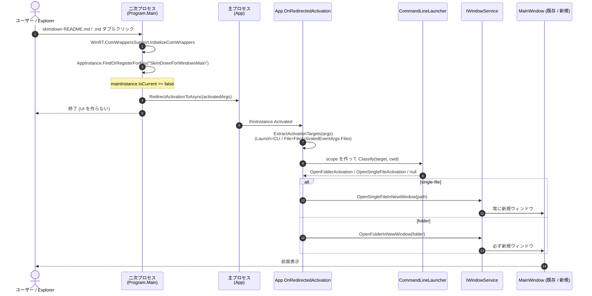

# 起動とシングルインスタンス

SkimDown for Windows は **1 プロセス / 複数ウィンドウ** で動く。2 個目以降の `skimdown` 起動や Explorer のダブルクリックは、既存プロセスに **redirect** されて新規ウィンドウだけが追加で開く。`settings.json` への書き込み競合は構造的に発生しない。

判断の経緯は [ADR-0005](../.github/adr/0005-single-file-mode-and-file-activation.md)。

## 全体像



## 自前エントリーポイント ([`Program.cs`](../src/SkimDownForWindows/Program.cs))

WinUI 3 のデフォルトは XAML ジェネレーターが `Main` を自動生成する。SkimDown は csproj で `DISABLE_XAML_GENERATED_MAIN` を立て、自前の `Program.Main` を使う。これにより `Application.Start` 前に **single-instance redirect** を入れられる。

`Main` の処理:

1. 親プロセスがコンソールホスト (`pwsh` / `cmd` / `WindowsTerminal` 等) なら、自分自身を子プロセスとして spawn して `return 0` (CLI 起動時に親ターミナルを即時解放するため。詳細は下の「親ターミナルの解放」)
2. `WinRT.ComWrappersSupport.InitializeComWrappers()` — WinRT 型 marshal の初期化 (generated Main と同じ)
3. `AppInstance.GetCurrent()` / `AppInstance.FindOrRegisterForKey("SkimDownForWindowsMain")`
   - キーが未登録ならカレントプロセスが **主インスタンス** として登録される
   - 既に主インスタンスがあれば、それが `mainInstance` として返る (`mainInstance.IsCurrent` で判別)
4. 二次インスタンスの場合: `mainInstance.RedirectActivationToAsync(activatedArgs)` で activation を主プロセスに転送して `return 0` (UI を作らずに終了)
5. 主インスタンスの場合: `thisInstance.Activated += App.OnRedirectedActivation` を `Application.Start` の **前** に subscribe してから `Application.Start(p => { ... new App(); })` を呼ぶ

`Application.Start` のラムダ内で `DispatcherQueueSynchronizationContext` をセットし、`new App()` を呼ぶ (generated Main と同等)。

### 親ターミナルの解放 (CLI 起動時の self-relaunch)

`windows.appExecutionAlias` 経由で `skimdown <path>` が PowerShell / cmd から起動されると、起動元のシェルは spawn した SkimDown プロセスを `WaitForSingleObject` で待ち続ける。これは GUI subsystem (PE subsystem = 2) の SkimDown 自体がコンソール出力を持たなくても、`FreeConsole` で子プロセスのコンソールを detach しても止まらない (シェルはプロセスハンドルで wait しているため)。

このため `Program.Main` の **先頭** で次の手順を踏む:

1. 親プロセスがコンソールホスト (`pwsh` / `powershell` / `cmd` / `conhost` / `WindowsTerminal` / `wt` / `OpenConsole`) なら、`Environment.ProcessPath` で自分自身を `ProcessStartInfo` (`UseShellExecute = false`, `CreateNoWindow = true`, `RedirectStandardInput/Output/Error = true`) として再起動する。同じ引数を `ArgumentList` で渡す
2. 子プロセスの環境には marker env var `SKIMDOWNFORWINDOWS_DETACHED_RELAUNCH=1` をセットして無限再帰を防ぐ
3. 親プロセスは `return 0` で即終了する。これにより起動元シェルの `WaitForSingleObject` が完了し、PowerShell のプロンプトが直ちに戻る
4. 子プロセス側は `Main` の冒頭で marker を検出し、`Environment.SetEnvironmentVariable(...)` で消した上で通常フロー (WinRT 初期化 → single-instance redirect → `Application.Start`) に入る

子プロセスの std handles は anonymous pipe に差し替えられるため、PowerShell の標準入出力を直接掴まない (親終了で pipe は自然に閉じる)。

親プロセス名による判定は次の理由による:
- packaged WinUI app (broker spawn) では `GetConsoleWindow()` が常に 0 を返すため、コンソールへの attach 有無では判定できない
- `windows.appExecutionAlias` は 0 バイトの reparse point ファイル (`%LOCALAPPDATA%\Microsoft\WindowsApps\skimdown.exe`) で、kernel filter が解決して `SkimDownForWindows.exe` を直接起動する。起動元シェルからは別プロセスを介さず親 PID = シェル PID になる
- 親 PID は `NtQueryInformationProcess` の `PROCESS_BASIC_INFORMATION.InheritedFromUniqueProcessId` から取得する

親プロセス名が上記リストに該当しない場合 (Explorer ダブルクリック / Start Menu / file activation / `winapp run` のような dev 経路) は self-relaunch せず通常フローに入る。

## 主プロセス側の受信 ([`App.OnRedirectedActivation`](../src/SkimDownForWindows/App.xaml.cs))

`thisInstance.Activated` は二次プロセスから redirect を投げてきた **そのプロセスの thread** から呼ばれる可能性がある。安全のため、まず UI スレッドの `DispatcherQueue` に dispatch する。

```csharp
public static void OnRedirectedActivation(object? sender, AppActivationArguments e)
{
    if (e is null) return;
    lock (s_pendingGate)
    {
        if (!s_isReady || s_uiDispatcher is null)
        {
            s_pendingActivations.Enqueue(e);   // OnLaunched 完了前は queue に貯める
            return;
        }
    }
    s_uiDispatcher!.TryEnqueue(() => HandleRedirectedActivation(e));
}
```

`Application.Start` から `App.OnLaunched` までの隙間に redirect が届く可能性があるため、`s_isReady` フラグが立つまでは pending queue に保存する。`OnLaunched` の末尾でフラグを立て、queue を drain する。

## 起動時のアクティベーション解決 ([`App.OnLaunched`](../src/SkimDownForWindows/App.xaml.cs))

主プロセスが最初に立ち上がった時の流れ:

1. UI スレッドの `DispatcherQueue` を `s_uiDispatcher` に保存
2. `ServiceProviderFactory.Build(...)` で `App.Services` を構築 ([dependency-injection.md](dependency-injection.md) 参照)
3. `Services.GetRequiredService<ISettingsRepository>().Load()` で `settings.json` をディスクから読込
4. `AppInstance.GetCurrent().GetActivatedEventArgs()` で起動時の activation を取得
5. `ExtractActivationTargets(activation)` で開く対象パス一覧に変換
6. `OpenFirstWindowFromActivation(targets)` で 1 個目のウィンドウを開く (残りも処理)
7. `s_isReady = true` にし、`s_pendingActivations` を drain

## `ExtractActivationTargets` の分岐

`AppActivationArguments.Kind` で分岐する。

| `ExtendedActivationKind` | 取り方 | 備考 |
|---|---|---|
| `File` | `((FileActivatedEventArgs)args.Data).Files` を `StorageFile.Path` / `StorageFolder.Path` に変換 | Explorer ダブルクリック / Open With。複数選択あり |
| `Launch` (および既定) | `Environment.GetCommandLineArgs()[1..]` のうち、空白でないかつ `-` で始まらないものを採用 | CLI 起動 (`skimdown README.md`) や、引数なしの通常起動 |

引数なしの `Launch` の場合は targets が空。`OpenFirstWindowFromActivation` は空 → `CreateWindow(initialFolderPath: null, restoreLastFolder: true)` で **last folder を復元** する起動になる。

## パス → activation の分類 ([`CommandLineLauncher.Classify`](../src/SkimDownForWindows.Application/CommandLine/CommandLineLauncher.cs))

各 target パスを `InitialActivation` に分類する。`IFileSystem` 抽象経由なのでテスト可能。

| `path` | 結果 |
|---|---|
| ディレクトリが存在する | `OpenFolderActivation(canonicalPath)` |
| ファイルが存在し、拡張子が `.md` / `.markdown` | `OpenSingleFileActivation(canonicalPath)` |
| 上記以外 (存在しない / 非 Markdown ファイル / 不正パス) | `null` |

相対パスは `Environment.CurrentDirectory` 起点で解決される (呼び出し側が `cwd` を渡す)。

## `InitialActivation` 表現

[`InitialActivation`](../src/SkimDownForWindows.Application/Models/InitialActivation.cs) は次の 2 サブ型を持つ discriminated record:

```csharp
public abstract record InitialActivation;
public sealed record OpenFolderActivation(string FolderPath) : InitialActivation;
public sealed record OpenSingleFileActivation(string FilePath) : InitialActivation;
```

`CommandLineLauncher` / `MainPageStartArgs` / `IWindowService` / `MainWindow` の共通言語として、folder mode と single-file activation の二択を型レベルで表す。`MainPage.OnNavigatedTo` がこのレコードを見て VM の `OpenFolderAsync` / `OpenSingleFileAsync` のどちらを呼ぶかを決める。`OpenSingleFileAsync` は `AppSettings.OpenContainingFolderOnSingleFileActivation` が `true` の場合、内部で「親フォルダーを開いて対象ファイルを選択する」挙動に切り替わる。

## ウィンドウ生成パス ([`IWindowService`](../src/SkimDownForWindows.Application/Abstractions/IWindowService.cs) / [`WindowService`](../src/SkimDownForWindows/Composition/WindowService.cs))

| API | 用途 | 既存ウィンドウ再利用 |
|---|---|---|
| `CreateWindow(initialFolderPath?, restoreLastFolder)` | 一般的なウィンドウ作成 (空ウィンドウ / folder mode 指定起動 / last folder 復元) | しない (常に新規) |
| `OpenFolderInNewWindow(folderPath)` | フォルダーを新規ウィンドウで開く (例: フォルダー drop で既にフォルダーを開いているウィンドウへ drop された時) | しない |
| `OpenSingleFile(filePath)` | single-file mode で開く (内部 API) | **再利用候補あり** (`IsEmptyOrSingleFile == true` のウィンドウがあればそこに流す) |
| `OpenSingleFileInNewWindow(filePath)` | single-file mode で必ず新規ウィンドウで開く | しない |
| `OpenSingleFilesInWindows(filePaths)` | 複数ファイル: 1 個目は再利用、残りは新規 | 1 個目のみ |
| `ActivateWindow(handle)` | 前面に出す (`MoveInZOrderAtTop + Activate`) | — |

「既存ウィンドウ再利用」は `IsEmptyOrSingleFile` (= `!HasFolder || IsSingleFileMode`) のウィンドウを 1 つ選ぶ。**folder mode のウィンドウは再利用候補にしない**ことで、既にフォルダー閲覧中のユーザーの作業を壊さない。

## 起動時 vs Redirect 時の挙動差

`App.OpenFirstWindowFromActivation` (起動時) は初回ウィンドウを作る専用フロー、`App.DispatchActivationTargets` (redirect 受信時) は既存プロセスに届いた対象を順次処理するフローとして分かれている。redirect 時の single-file は、file activation / launch activation のどちらでも新規ウィンドウで開く。

| シーン | 1 個目の振る舞い | 2 個目以降の振る舞い |
|---|---|---|
| プロセス起動時 (targets 空) | `CreateWindow(null, restoreLastFolder: true)` で last folder を復元 | — |
| プロセス起動時 (1 件以上、最初が single-file) | `OpenSingleFileInNewWindow` (起動直後にウィンドウを必ず新規で作る) | 各 target ごとに `OpenSingleFileInNewWindow` / `OpenFolderInNewWindow` |
| プロセス起動時 (最初が folder) | `CreateWindow(initialFolderPath: ofa.FolderPath, restoreLastFolder: false)` | 同上 |
| Redirect 受信時 (single-file) | `OpenSingleFileInNewWindow` (常に新規) | 必ず新規 |
| Redirect 受信時 (folder) | `OpenFolderInNewWindow` (常に新規) | 必ず新規 |

## File Type Association ([`Package.appxmanifest`](../src/SkimDownForWindows/Package.appxmanifest))

`windows.fileTypeAssociation` 拡張で `.md` / `.markdown` を SkimDown に紐付ける。`windows.appExecutionAlias` で `skimdown.exe` を登録する。これにより:

- Explorer で `.md` を右クリック → Open with → SkimDown で開ける
- 任意のフォルダーで `skimdown README.md` / `skimdown .` がコマンドラインから動く (MSIX install 時に自動登録される PATH エイリアス)

## 終了処理

最終ウィンドウが閉じた時の連鎖:

1. `WindowService.OnWindowClosed` がレジストリから削除
2. `_windows.Count == 0` なら `_onLastWindowClosed` (= `App.ExitApp`) を呼ぶ
3. `App.ExitApp`: `ISettingsRepository.FlushSync()` で最終フラッシュ、`Application.Current.Exit()`

各ウィンドウ閉鎖時には `MainWindow.OnClosed` が自身の `IServiceScope.Dispose()` を呼び、Scoped 登録の VM / `IFolderWatcher` が dispose される ([dependency-injection.md](dependency-injection.md#ウィンドウスコープのライフサイクル) 参照)。

## 関連

- ADR: [0005 Single-file mode と File Activation の導入](../.github/adr/0005-single-file-mode-and-file-activation.md)
- SPEC: [`design/SPEC.md`](../design/SPEC.md) の「フォルダを開く」「単一ファイルを開く」「Single-instance behavior」
- 隣接ドキュメント: [`dependency-injection.md`](dependency-injection.md), [`markdown-content-pipeline.md`](markdown-content-pipeline.md), [`settings-and-state.md`](settings-and-state.md)
- コード: [`Program.cs`](../src/SkimDownForWindows/Program.cs), [`App.xaml.cs`](../src/SkimDownForWindows/App.xaml.cs), [`WindowService.cs`](../src/SkimDownForWindows/Composition/WindowService.cs), [`CommandLineLauncher.cs`](../src/SkimDownForWindows.Application/CommandLine/CommandLineLauncher.cs), [`InitialActivation.cs`](../src/SkimDownForWindows.Application/Models/InitialActivation.cs), [`Package.appxmanifest`](../src/SkimDownForWindows/Package.appxmanifest)
