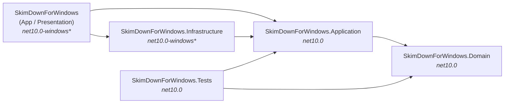
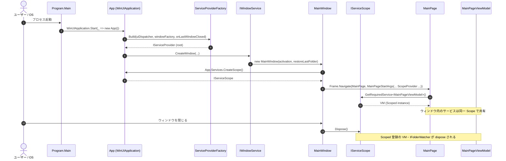

# アーキテクチャー

SkimDown for Windows は **WinUI 3 + Windows App SDK 2.0.1 + WebView2 + CommunityToolkit.Mvvm** の Markdown ビューアーで、5 つの csproj に分割された **クリーンアーキテクチャー風** のレイアウトを採る。本ページは「いま、どのプロジェクトがどう連結しているか」のスナップショットを記述する。判断の経緯は [ADR-0002](../.github/adr/0002-clean-architecture-layered-projects.md) を参照。

## プロジェクト構成

| プロジェクト | TFM | 役割 | コード |
|---|---|---|---|
| `SkimDownForWindows.Domain` | `net10.0` | 副作用ゼロの値オブジェクト・列挙のみ (`AppTheme`, `SidebarPosition`, `LinkKind`, `LinkClassification`)。他プロジェクトを参照しない | [src/SkimDownForWindows.Domain](../src/SkimDownForWindows.Domain) |
| `SkimDownForWindows.Application` | `net10.0` | ユースケース層。抽象 I/F・純粋ロジック・ViewModel・UI バインドモデル・コマンドライン解釈・テーマ解決。プラットフォーム実装 (`System.IO`, `Process`, `Windows.*`) を参照しない | [src/SkimDownForWindows.Application](../src/SkimDownForWindows.Application) |
| `SkimDownForWindows.Infrastructure` | `net10.0-windows10.0.26100.0` | Application 抽象の WinRT / `System.IO` 実装。`Microsoft.WindowsAppSDK` は **不参照** (WinUI 依存を Presentation に閉じるため) | [src/SkimDownForWindows.Infrastructure](../src/SkimDownForWindows.Infrastructure) |
| `SkimDownForWindows` (App / Presentation) | `net10.0-windows10.0.26100.0` | XAML ページ / `MarkdownPreview` UserControl / コンポジションルート (`App.Services`) / WindowsAppSDK 依存実装 (`DispatcherQueueUiDispatcher`, `WindowService`) | [src/SkimDownForWindows](../src/SkimDownForWindows) |
| `SkimDownForWindows.Tests` | `net10.0` | Domain + Application の単体テスト。Infrastructure は参照しない (プラットフォーム中立) | [src/SkimDownForWindows.Tests](../src/SkimDownForWindows.Tests) |

## 依存方向

依存は内向きの一方通行。逆方向の参照は csproj レベルで禁止される。

Application は Infrastructure を直接知らず、`Application/Abstractions/` 配下の I/F 経由で操作する (具体的な I/F → 実装の対応表は [dependency-injection.md](dependency-injection.md#ports--adapters-対応表))。

## 各プロジェクトの内部構造

### Domain

副作用ゼロの値オブジェクトと列挙のみ。

- [`AppTheme.cs`](../src/SkimDownForWindows.Domain/AppTheme.cs): `AppTheme` (System / Light / Dark / Custom), `SidebarPosition` (Left / Right)
- [`LinkClassification.cs`](../src/SkimDownForWindows.Domain/LinkClassification.cs): `LinkKind` (Anchor / RelativeMarkdown / RelativeNonMarkdown / OutOfFolder / External / Blocked), `LinkClassification` レコード

### Application

| サブフォルダー | 中身 |
|---|---|
| [`Abstractions/`](../src/SkimDownForWindows.Application/Abstractions) | 13 個の `I*` 抽象 (`IFileSystem`, `IFolderWatcher`, `ISettingsRepository`, …) |
| [`Models/`](../src/SkimDownForWindows.Application/Models) | 永続化 DTO (`AppSettings`, `FolderState`)、UI バインドモデル (`MarkdownTreeItem`, `RecentFolderEntry`, `LoadRequest`)、起動時表現 (`InitialActivation`, `OpenFolderActivation`, `OpenSingleFileActivation`)、テーマ (`ColorScheme`, `ThemeSelection`, `AppThemeJsonConverter`) |
| [`Markdown/`](../src/SkimDownForWindows.Application/Markdown) | 純粋サービス: `MarkdownScanner`, `MarkdownTreeBuilder`, `InitialSelectionPicker`, `LinkResolver` |
| [`Theme/`](../src/SkimDownForWindows.Application/Theme) | `ColorSchemeRegistry`, `ColorMapping`, `ColorValueValidator`, `ResolvedTheme` |
| [`CommandLine/`](../src/SkimDownForWindows.Application/CommandLine) | `CommandLineLauncher` (引数 → `InitialActivation` 解釈) |
| [`ViewModels/`](../src/SkimDownForWindows.Application/ViewModels) | `MainPageViewModel : ObservableObject, IDisposable` |
| [`Utilities/`](../src/SkimDownForWindows.Application/Utilities) | `PathHelpers` (純粋 `Path.*` ヘルパー) |
| [`DependencyInjection/`](../src/SkimDownForWindows.Application/DependencyInjection) | `ApplicationServiceCollectionExtensions.AddSkimDownApplication` |

### Infrastructure

| サブフォルダー | 中身 |
|---|---|
| [`IO/`](../src/SkimDownForWindows.Infrastructure/IO) | `LocalFileSystem`, `LocalMarkdownFileReader`, `JsonSettingsRepository`, `LocalColorSchemeSource`, `SettingsFolderProvider`, `FileSystemFolderWatcher`, `FileAppLogger` |
| [`Windows/`](../src/SkimDownForWindows.Infrastructure/Windows) | `WindowsClipboardService`, `ExplorerShellService`, `UiSettingsThemeProvider`, `LauncherExternalUriService`, `PackageAppInfoService` |
| [`DependencyInjection/`](../src/SkimDownForWindows.Infrastructure/DependencyInjection) | `InfrastructureServiceCollectionExtensions.AddSkimDownInfrastructure` |

### Presentation (App)

| 場所 | 中身 |
|---|---|
| [`App.xaml.cs`](../src/SkimDownForWindows/App.xaml.cs) | コンポジションルート。`App.Services` (ルート `IServiceProvider`) を公開、起動時 / redirect の activation を処理 |
| [`Program.cs`](../src/SkimDownForWindows/Program.cs) | 自前エントリーポイント。`AppInstance.FindOrRegisterForKey` による single-instance redirect |
| [`MainWindow.xaml.cs`](../src/SkimDownForWindows/MainWindow.xaml.cs) | ウィンドウごとの `IServiceScope` を所有。`MainPageStartArgs` を `MainPage` へ渡す |
| [`MainPage.xaml.cs`](../src/SkimDownForWindows/MainPage.xaml.cs) | XAML パラメーターレス ctor を持つ Page。`OnNavigatedTo` でスコープから VM 解決 |
| [`Viewer/`](../src/SkimDownForWindows/Viewer) | `MarkdownPreview` UserControl (WebView2 ホスト) |
| [`Composition/`](../src/SkimDownForWindows/Composition) | `ServiceProviderFactory`, `WindowService`, `MainWindowHandle`, `DispatcherQueueUiDispatcher` |

## ウィンドウスコープモデル

`App.Services` がプロセス共通のルート `IServiceProvider`。各 `MainWindow` は自前の `IServiceScope` を所有し、閉じた時に dispose する。Window 寿命のサービス (`IFolderWatcher`, `MainPageViewModel`, Markdown 純粋サービス, `CommandLineLauncher`) はそのスコープから resolve される。

詳しい登録一覧とライフサイクルは [dependency-injection.md](dependency-injection.md) を参照。

## ファイル配置原則

| 種類 | 配置 |
|---|---|
| 列挙・純粋値オブジェクト | `SkimDownForWindows.Domain/` |
| 抽象インターフェース | `SkimDownForWindows.Application/Abstractions/` |
| 永続化 DTO / UI バインドモデル | `SkimDownForWindows.Application/Models/` |
| 純粋サービス (Markdown 解析・選択・リンク分類) | `SkimDownForWindows.Application/Markdown/` |
| ViewModel | `SkimDownForWindows.Application/ViewModels/` |
| パスユーティリティ | `SkimDownForWindows.Application/Utilities/` |
| コマンドライン解釈 | `SkimDownForWindows.Application/CommandLine/` |
| DI 登録拡張メソッド | `*.Application/DependencyInjection/`, `*.Infrastructure/DependencyInjection/` |
| ファイル I/O 実装 | `SkimDownForWindows.Infrastructure/IO/` |
| WinRT 実装 | `SkimDownForWindows.Infrastructure/Windows/` |
| コンポジションルート / WindowsAppSDK 依存実装 | `SkimDownForWindows/Composition/` |
| XAML / Page / Window / UserControl | `SkimDownForWindows/` |
| UI 文字列リソース (locale 別) | `SkimDownForWindows/Strings/<locale>/Resources.resw` |

## 関連

- ADR: [0001 ADR 運用ルール](../.github/adr/0001-record-architecture-decisions.md), [0002 クリーンアーキテクチャー風の層分割と DI](../.github/adr/0002-clean-architecture-layered-projects.md), [0006 UI 文字列ローカライズに MRT (resw) と ResourceLoader を採用する](../.github/adr/0006-localization-with-resw-and-resourceloader.md)
- skill: [`clean-architecture/SKILL.md`](../.github/skills/clean-architecture/SKILL.md) (層境界 / DI / 抽象配置のチェックリスト)
- copilot-instructions: [`copilot-instructions.md`](../.github/copilot-instructions.md) (「必ず守るルール」「ファイル配置のルール」)
- 隣接ドキュメント: [`dependency-injection.md`](dependency-injection.md), [`markdown-content-pipeline.md`](markdown-content-pipeline.md), [`localization.md`](localization.md)
