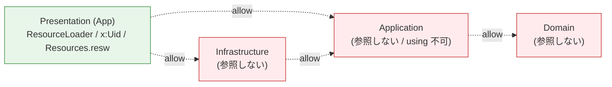

# ローカライズ (UI 文字列リソース)

SkimDown for Windows の UI 文字列は **Modern Resource Technology (MRT)** をベースに、`Strings/<locale>/Resources.resw` と `Windows.ApplicationModel.Resources.ResourceLoader` で解決される。本ページは「いまどのファイルに何が置かれ、どの API でどう読み出されているか」のスナップショットを記述する。判断の経緯は [ADR-0006](../.github/adr/0006-localization-with-resw-and-resourceloader.md) を参照。

## ファイル配置

```
src/SkimDownForWindows/
├── Strings/
│   └── en-US/
│       └── Resources.resw     ← 全 UI 文字列
├── MainPage.xaml              ← x:Uid で resw を参照
├── MainPage.xaml.cs           ← ResourceLoader で動的文字列を取得
├── MainWindow.xaml.cs         ← ResourceLoader で Title を取得
├── SettingsDialog.xaml        ← x:Uid で resw を参照
├── AboutDialog.xaml           ← x:Uid のみ
└── Package.appxmanifest       ← <Resource Language="x-generate" />
```

リソース関連は **App プロジェクト (`SkimDownForWindows`) 配下に閉じる**。Application / Infrastructure クラスライブラリ側には resw を持たせない。

| 種類 | 場所 |
|---|---|
| 文字列リソース (locale 別) | `src/SkimDownForWindows/Strings/<locale>/Resources.resw` |
| `ResourceLoader` 利用 | `src/SkimDownForWindows/MainPage.xaml.cs`, `src/SkimDownForWindows/MainWindow.xaml.cs` |
| `x:Uid` 参照 | `src/SkimDownForWindows/MainPage.xaml`, `src/SkimDownForWindows/MainWindow.xaml`, `src/SkimDownForWindows/SettingsDialog.xaml`, `src/SkimDownForWindows/AboutDialog.xaml` |
| サポートロケール宣言 | `src/SkimDownForWindows/Package.appxmanifest` の `<Resources>` 要素 |

## サポート対象ロケール

現状は **`en-US` の 1 ロケールのみ**。

`Package.appxmanifest` は `<Resource Language="x-generate" />` を指定し、MSIX ビルド時に `Strings/<locale>/` フォルダー一覧から PRI (Package Resource Index) を自動生成する。新しいロケール (例: `ja-JP`) を追加した場合は、`Strings/ja-JP/Resources.resw` を作るだけでビルドが認識する。`<DefaultLanguage>` は明示せず、MRT 既定のフォールバック挙動 (現状 `en-US`) に任せている。

## resw キーの 2 系統

resw 上のキー (`name` 属性) は用途別に 2 つの形式が混在する。MRT の仕様で、`ResourceLoader.GetString` は **resource map path 表記** (`.` を `/` に置換) を要求する。

| 用途 | resw キー形式 | 例 | 消費側 |
|---|---|---|---|
| `x:Uid` バインド | `<UidName>.<PropertyName>` | `AboutDialog.Title`, `OpenFolderMenuItem.Text`, `SearchPreviousButton.AutomationProperties.Name`, `ViewModeTreeButton.ToolTipService.ToolTip`, `ViewModeRecentButton.AutomationProperties.Name` | XAML (`x:Uid="AboutDialog"` で `AboutDialog.*` 系プロパティを自動解決) |
| `ResourceLoader.GetString` 直呼び | `<Category>.<Key>` | `MarkdownCount.OneFile`, `Sidebar.MoveToRight`, `RecentFolders.Empty`, `TableOfContents.Title` | code-behind (`_strings.GetString("MarkdownCount/OneFile")` のように `.` → `/`) |

両者は resw 上では同じ `<data name="...">` で表現され、ロケール追加時はどちらも同じ翻訳プロセスに乗る。

## XAML からの参照 (`x:Uid`)

XAML 要素に `x:Uid="Foo"` を付けると、MRT は `Resources.resw` から `Foo.*` という名前で始まる全エントリーを探し、対応する DependencyProperty に流し込む。

```xml
<!-- MainPage.xaml -->
<MenuFlyoutItem x:Uid="OpenFolderMenuItem" Click="OnOpenFolderClick" />
```

```xml
<!-- Resources.resw -->
<data name="OpenFolderMenuItem.Text" xml:space="preserve">
  <value>Open Folder…</value>
</data>
```

→ MenuFlyoutItem の `Text` プロパティに `"Open Folder…"` が設定される。

サポートされる主なプロパティ:

| resw キーサフィックス | 設定先 |
|---|---|
| `.Text` | `TextBlock.Text`, `MenuFlyoutItem.Text` 等 |
| `.Title` | `Window.Title`, `MenuBarItem.Title`, `ContentDialog.Title` |
| `.Content` | `Button.Content`, `HyperlinkButton.Content`, `ContentDialog.CloseButtonText` (例外: `CloseButtonText`) |
| `.PlaceholderText` | `AutoSuggestBox.PlaceholderText` |
| `.ToolTipService.ToolTip` | アタッチド ToolTip |
| `.AutomationProperties.Name` | スクリーンリーダー読み上げ名 |

`AboutDialog.xaml` の `<Run x:Uid="LicensePrefix" />` のように `Run` 要素にも適用できる。

## コードビハインドからの参照 (`ResourceLoader`)

XAML で表現できない動的文字列 (count フォーマット / 状態遷移ラベル / 動的に構築するメニュー項目 / `DragUIOverride.Caption` 等) は、コードビハインドから直接取得する。

```csharp
// MainWindow.xaml.cs / MainPage.xaml.cs
private readonly ResourceLoader _strings = ResourceLoader.GetForViewIndependentUse();

// 取得
Title = _strings.GetString("MainWindow/Title");
MarkdownCountText.Text = string.Format(
    _strings.GetString("MarkdownCount/ManyFiles"),
    ViewModel.MarkdownCount);
```

`GetForViewIndependentUse()` は app default の resource map (`Strings/...`) を返す。`MainWindow` / `MainPage` で `private readonly` フィールドとして 1 インスタンス保持し、複数の取得呼び出しを 1 ファイル内で散らさない。

### 現在の `ResourceLoader.GetString` 利用箇所

| ファイル | キー | 用途 |
|---|---|---|
| `MainWindow.xaml.cs` | `MainWindow/Title`, `AppTitleBar/Title` | ウィンドウタイトルとタイトルバー |
| `MainPage.xaml.cs` | `MarkdownCount/OneFile`, `MarkdownCount/ManyFiles` | フッターの件数表示 (`string.Format` で件数注入) |
| `MainPage.xaml.cs` | `RecentFolders/Empty`, `RecentFolders/Clear` | Recent サブメニューの動的構築 |
| `MainPage.xaml.cs` | `DragDrop/OpenInNewWindow`, `DragDrop/OpenInSkimDown` | ドラッグオーバー時のオーバーレイ文言 |
| `MainPage.xaml.cs` | `Search/NoResults` | 検索結果ゼロ時の SearchStatus |
| `MainPage.xaml.cs` | `Sidebar/MoveToRight`, `Sidebar/MoveToLeft` | サイドバー位置トグルの label を状態で切り替え |
| `MainPage.xaml.cs` (`BuildPreviewLocalizedStrings`) | `MermaidZoom/*`, `TableOfContents/Title`, `TableOfContents/Empty` | WebView2 renderer に渡すローカライズ済み文字列。JS 側では `mermaidZoom.*` / `tableOfContents.*` キーとして使われる |

## レイヤー境界

`Windows.ApplicationModel.Resources` は WinRT 型のため、`net10.0` ターゲットの Application / Domain プロジェクトからは `using` できない (コンパイル時にエラー)。Infrastructure (`net10.0-windows*`) からは技術的には `using` 可能だが、ADR-0002 で「`Microsoft.WindowsAppSDK` を Infrastructure に持ち込まない」ポリシーと整合的に、本ポリシーでも Presentation 専有とする。



ViewModel (`MainPageViewModel`) は UI 文字列を保持せず、件数 / フラグ / state enum などの**フォーマット用の値**を公開するに留まる。フォーマット (例: 「ファイル 1 件」「ファイル 3 件」の単複切替) は Page 側のコードビハインドで `ResourceLoader` を使って組み立てる。

## サポート対象ロケールを増やす

新しいロケール (例: `ja-JP`) を追加する手順は次の通り。

1. `src/SkimDownForWindows/Strings/ja-JP/` フォルダーを作成
2. `Resources.resw` を作成し、`en-US/Resources.resw` の全 `<data>` を翻訳して入れる (キー名は変更しない)
3. `Package.appxmanifest` は `<Resource Language="x-generate" />` のままで、MSIX ビルド時に自動認識される
4. C# / XAML コードの変更は不要

翻訳もれが起きた場合の挙動: MRT は `Resources.resw` に該当キーが見つからない時、`<DefaultLanguage>` (未指定時は `en-US`) にフォールバックする。

## 関連

- ADR: [0002 クリーンアーキテクチャー風の層分割と DI](../.github/adr/0002-clean-architecture-layered-projects.md), [0006 UI 文字列ローカライズに MRT (resw) と ResourceLoader を採用する](../.github/adr/0006-localization-with-resw-and-resourceloader.md)
- copilot-instructions: [`copilot-instructions.md`](../.github/copilot-instructions.md) (「必ず守るルール」の UI 文字列の扱い)
- skill: [`clean-architecture/SKILL.md`](../.github/skills/clean-architecture/SKILL.md) (Presentation 専有 API の置き場)
- コード:
  - [`Strings/en-US/Resources.resw`](../src/SkimDownForWindows/Strings/en-US/Resources.resw)
  - [`MainPage.xaml.cs`](../src/SkimDownForWindows/MainPage.xaml.cs)
  - [`MainWindow.xaml.cs`](../src/SkimDownForWindows/MainWindow.xaml.cs)
  - [`AboutDialog.xaml`](../src/SkimDownForWindows/AboutDialog.xaml)
- 外部ドキュメント:
  - [MRT Core overview (Microsoft Learn)](https://learn.microsoft.com/windows/apps/windows-app-sdk/mrtcore/mrtcore-overview)
  - [`x:Uid` directive](https://learn.microsoft.com/windows/apps/design/globalizing/use-uid-attribute)
  - [`ResourceLoader` API](https://learn.microsoft.com/uwp/api/windows.applicationmodel.resources.resourceloader)
