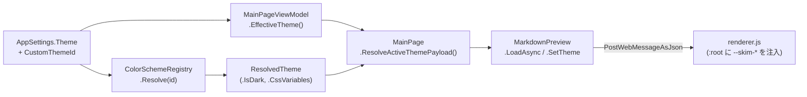

# テーマ

SkimDown for Windows のテーマは 4 モード — **System / Light / Dark / Custom (VS Code 互換)** — をサポートする。組み込み 3 モードは renderer のフォールバックパレットで描画され、Custom はユーザーが `Themes/*.json` に置いた VS Code カラーテーマを `--skim-*` CSS 変数に解決して使う。

判断の経緯は [ADR-0004](../.github/adr/0004-custom-color-schemes.md)。

## 4 つのテーマ ([`AppTheme`](../src/SkimDownForWindows.Domain/AppTheme.cs))

| `AppTheme` | 意味 | `CustomThemeId` |
|---|---|---|
| `System` | OS の Light / Dark に追従 | `null` |
| `Light` | 組み込み Light パレット (GitHub light 風) | `null` |
| `Dark` | 組み込み Dark パレット (GitHub dark 風) | `null` |
| `Custom` | `Themes/*.json` に登録された VS Code 互換テーマ | テーマファイル名 (`Path.GetFileNameWithoutExtension`) |

`AppSettings.Theme` と `AppSettings.CustomThemeId` の組み合わせは [`ThemeSelection`](../src/SkimDownForWindows.Application/Models/ThemeSelection.cs) に集約される。

## ファイル配置

カスタムテーマ JSON は [settings-and-state.md](settings-and-state.md#保存先) で定義される基底フォルダー配下の `Themes/` に置く。

- Packaged: `%LOCALAPPDATA%\Packages\<package-family>\LocalState\Themes\`
- Unpackaged: `%LOCALAPPDATA%\SkimDownForWindows\Themes\`

サブフォルダーは見ない。`*.json` のみ。ファイル名 (拡張子を除く) が **テーマ ID** になる。

UI からは **View > Theme > Open Themes Folder** で Explorer で開け、 **View > Theme > Reload Themes** で再走査する (フォルダー watch はしない)。

## JSON フォーマット

VS Code カラーテーマ JSON のサブセットを受理する。SkimDown が消費するキー:

| キー | 必須 | 用途 |
|---|---|---|
| `name` | 任意 | View > Theme のメニュー表示名。空 / 欠落なら ID をフォールバック |
| `type` | 任意 | `"light"` / `"dark"` / `"hc-light"` / `"hc-black"` (= `hc-dark`)。欠落時は `dark` |
| `colors` | 任意 | VS Code カラーキー → 色文字列 (例: `editor.background`) |

`tokenColors` 等の構文ハイライト系はパースしない (現状未対応。コードブロックは GitHub light / dark の固定 CSS)。

実装: [`ColorScheme.LoadFromJson`](../src/SkimDownForWindows.Application/Models/ColorScheme.cs)。型不一致のエントリ (文字列以外) はスキップし、例外は出さない。

## カラーマッピング

`colors` のキーを SkimDown の CSS 変数に解決するマッピング表は [`ColorMapping.All`](../src/SkimDownForWindows.Application/Theme/ColorMapping.cs) が真実。各 CSS 変数につき **優先順位順** に VS Code キーを試し、最初に見つかった安全な値を採用する。すべて欠落 / 不正なら [`FallbackPalette`](../src/SkimDownForWindows.Application/Theme/ColorMapping.cs) (`type` の Light/Dark に応じた既定) を使う。

| CSS 変数 (`--skim-*`) | VS Code キー (優先順) |
|---|---|
| `--skim-bg` | `editor.background` |
| `--skim-fg` | `editor.foreground` → `foreground` |
| `--skim-muted` | `descriptionForeground` → `disabledForeground` |
| `--skim-border` | `panel.border` → `editorGroup.border` → `editorWidget.border` → `contrastBorder` |
| `--skim-soft` | `editorGroupHeader.tabsBackground` → `editor.lineHighlightBackground` → `sideBar.background` |
| `--skim-soft-strong` | `editorWidget.background` → `editor.background` |
| `--skim-code-bg` | `editor.lineHighlightBackground` → `editorGroupHeader.tabsBackground` |
| `--skim-table-stripe` | `editorGroupHeader.tabsBackground` → `editor.lineHighlightBackground` |
| `--skim-link` | `textLink.foreground` → `editorLink.activeForeground` → `focusBorder` |
| `--skim-blockquote` | `descriptionForeground` → `editor.foreground` |
| `--skim-mark-bg` | `editor.findMatchHighlightBackground` |
| `--skim-mark-current-bg` | `editor.findMatchBackground` |

新しいキーを足したい場合は `ColorMapping.All` にエントリを追加すれば良い (renderer 側は `--skim-*` プレフィックスのホワイトリスト方式で受けるため、追加でフィルタの変更は不要)。

## 値のサニタイズ ([`ColorValueValidator`](../src/SkimDownForWindows.Application/Theme/ColorValueValidator.cs))

採用前にすべての値を `ColorValueValidator.Normalize` に通す。許可される形式:

- `#rgb`, `#rgba`, `#rrggbb`, `#rrggbbaa`
- `rgb(...)`, `rgba(...)`
- `hsl(...)`, `hsla(...)` (`deg` / `turn` / `grad` / `rad` 単位を含めて可)
- 文字列 `transparent` (case-insensitive)

拒否される (フォールバック値が使われる) 形式:

- `var(--x)`, `calc(...)`, `url(...)` を含むもの
- `;`, `{`, `}`, `<`, `>`, `\`, 改行を含むもの (CSS 流出防止)
- `MaxLength = 64` 文字を超えるもの
- CSS Color Level 4 の space-separated 形式 (`rgb(255 0 0)` 等) — 将来拡張

renderer 側でも `--skim-*` プレフィックスのみ通す追加防御を入れている ([webview2-preview.md](webview2-preview.md#テーマの伝達) 参照)。

## レジストリ ([`ColorSchemeRegistry`](../src/SkimDownForWindows.Application/Theme/ColorSchemeRegistry.cs))

Singleton。アプリ全体で 1 つのテーマ一覧 + 解決キャッシュを保持する。

| API | 意味 |
|---|---|
| `Schemes` | 直近 Reload の登録テーマ一覧 (DisplayName 昇順、case-insensitive) |
| `DirectoryPath` | Themes フォルダー絶対パス (UI 表示用) |
| `Reload()` | `IColorSchemeSource.Load()` で再走査。失敗ファイルはスキップ。最後に `ThemesChanged` 発火 |
| `Find(id)` | ID 一致のテーマを返す。無ければ `null` |
| `Resolve(id)` | `ResolvedTheme` をキャッシュ付きで返す。無ければ `null` |
| `Normalize(selection)` / `Normalize(theme, customId)` | `AppTheme.Custom` で ID が無効なら `System` に戻す |
| `ThemesChanged` (event) | Reload 後に発火。購読側は UI スレッドへ marshal する責務 |

`ThemesChanged` の UI 反映は `MainPage` 側で `RebuildCustomThemeMenuItems` 等が `View > Theme` メニューを再構築する。

## 解決パイプライン ([`ResolvedTheme`](../src/SkimDownForWindows.Application/Theme/ResolvedTheme.cs))

`Resolve` が呼ばれた時の流れ:

1. `FallbackPalette.For(scheme.Type.IsDark())` で light/dark 既定辞書を取得
2. `ColorMapping.All` を上から走査
   - 各 entry の `VsCodeKeys` を順に試す
   - 最初の安全な値 (`ColorValueValidator.Normalize` 通過) を採用
   - 全部欠落なら fallback 辞書を引く
3. すべての `--skim-*` 値が決まった `ResolvedTheme(id, displayName, type, cssVariables)` を返す
4. レジストリが結果を `_resolvedCache[id]` にキャッシュ

`ResolvedTheme.IsDark` は `Type.IsDark()` (Dark / HighContrastDark を `true`)。

## WebView2 への反映

[`MainPage.ResolveActiveThemePayload`](../src/SkimDownForWindows/MainPage.xaml.cs) が現在のテーマ選択を 3 つ組 `(themeKey, isDark, themeVars)` に分解する。

| `AppSettings.Theme` | `themeKey` | `isDark` | `themeVars` |
|---|---|---|---|
| `Light` | `"light"` | `false` | `null` (renderer 既定の `--skim-*` を使う) |
| `Dark` | `"dark"` | `true` | `null` |
| `System` | `EffectiveTheme()` の結果 (`"light"` / `"dark"`) | 同 | `null` |
| `Custom`、レジストリ解決成功 | `"custom"` | `resolved.IsDark` | `resolved.CssVariables` |
| `Custom`、レジストリで見つからず | `EffectiveTheme()` の結果 | 同 | `null` |

これを次の 2 経路で renderer に届ける:

| Host メソッド | renderer メッセージ |
|---|---|
| `MarkdownPreview.LoadAsync(markdown, relPath, themeKey, isDark, themeVars)` | `{type:"render", ..., theme, themeType, themeIsDark, themeVars}` (Markdown 描画と同時にテーマも適用) |
| `MarkdownPreview.SetTheme(themeKey, isDark, themeVars)` | `{type:"theme", ...}` (Markdown は変えずテーマだけ切替) |

renderer 側は `themeVars` を `document.documentElement.style.setProperty(name, value)` で `:root` に注入する (プレフィックスチェックを再実行)。さらに `themeIsDark` に応じて `vendor/github.min.css` / `vendor/github-dark.min.css` を入れ替え、Mermaid テーマも切り替える。

## 関連

- ADR: [0004 VS Code 互換のカスタムカラースキーマ対応](../.github/adr/0004-custom-color-schemes.md)
- SPEC: [`design/SPEC.md`](../design/SPEC.md) の「カラーテーマ」「プレビュー」
- README: [`Custom color schemes`](../README.md#custom-color-schemes) (ユーザー視点での書き方とフォルダー位置)
- 隣接ドキュメント: [`webview2-preview.md`](webview2-preview.md), [`settings-and-state.md`](settings-and-state.md)
- コード: [`ColorSchemeRegistry.cs`](../src/SkimDownForWindows.Application/Theme/ColorSchemeRegistry.cs), [`ResolvedTheme.cs`](../src/SkimDownForWindows.Application/Theme/ResolvedTheme.cs), [`ColorMapping.cs`](../src/SkimDownForWindows.Application/Theme/ColorMapping.cs), [`ColorValueValidator.cs`](../src/SkimDownForWindows.Application/Theme/ColorValueValidator.cs), [`ColorScheme.cs`](../src/SkimDownForWindows.Application/Models/ColorScheme.cs), [`LocalColorSchemeSource.cs`](../src/SkimDownForWindows.Infrastructure/IO/LocalColorSchemeSource.cs), [`MainPage.xaml.cs`](../src/SkimDownForWindows/MainPage.xaml.cs)
