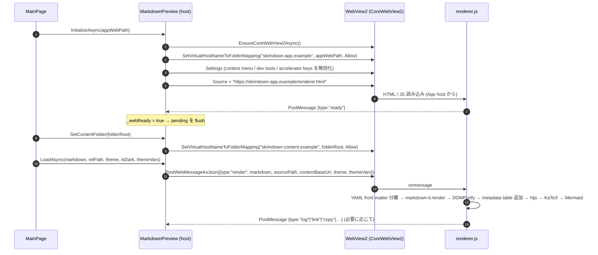

# WebView2 プレビュー

Markdown はすべて WebView2 上のレンダラー (`Assets/Web/renderer.html` + `renderer.js`) で HTML 化される。本ページは host (C#) ↔ renderer (JavaScript) の境界仕様 — どの virtual host が何にマップされ、どのメッセージが行き来し、どんな順で初期化されるか — を記述する。

実装: [`MarkdownPreview.xaml.cs`](../src/SkimDownForWindows/Viewer/MarkdownPreview.xaml.cs) (host)、`src/SkimDownForWindows/Assets/Web/renderer.{html,js}` (renderer)。

## 二重 origin によるサンドボックス

`CoreWebView2.SetVirtualHostNameToFolderMapping` を 2 つの異なるホスト名で行い、**アプリのレンダラーアセット** と **ユーザーが開いたフォルダー** を別 origin に分離する。

| 役割 | virtual host | マップ先 | 設定タイミング |
|---|---|---|---|
| App-asset host (バンドル UI) | `https://skimdown-app.example/` | `Assets/Web/` (`AppContext.BaseDirectory/Assets/Web`) | `InitializeAsync` 1 回のみ。WebView2 のソース URL は `https://skimdown-app.example/renderer.html` |
| Content host (開いているフォルダー) | `https://skimdown-content.example/` | 現在開いているフォルダーの絶対パス | フォルダーを開き直すたびに `SetContentFolder(folderRoot)` で再マップ (`ClearVirtualHostNameToFolderMapping` → `SetVirtualHostNameToFolderMapping`) |

別 origin であるため、レンダラー側 (`skimdown-app.example`) の JavaScript からは Same-Origin Policy で `skimdown-content.example` のリソースを fetch することはできない。Markdown 本文の **テキスト** は host (C#) が `PostWebMessageAsJson` で明示的に渡す。本文がレンダラー origin から直接ファイルを読まないので、renderer 側の脆弱性があっても任意のフォルダー内容をネットワークに漏らすことができない。

`Markdown 本文の渡し方` は `PostWebMessageAsJson` 1 本に限定される。**`NavigateToString` は使わない** (二重 origin 分離を壊し、メッセージプロトコルとも不整合になるため。判断の経緯は ADR を参照)。

## バンドルされる renderer アセット

`src/SkimDownForWindows/Assets/Web/` に同梱され、ビルド時に出力ディレクトリにコピーされる (`*.csproj` の `<Content Include="Assets\Web\**\*.*">` 参照)。CDN 取得は一切行わずオフライン動作する。

| ファイル | 中身 |
|---|---|
| `renderer.html` | エントリーポイント。`renderer.js` と `skimdown.css`、各 vendor を読み込む |
| `renderer.js` | host メッセージ受信ループ、YAML front matter の metadata table 化、markdown-it 構成、Table of Contents、リンク・ショートカット・検索・ズームのハンドラー |
| `skimdown.css` | アプリ既定のスタイル / フォールバック `--skim-*` 変数 / preview 内 Table of Contents レイアウト |
| `vendor/markdown-it.min.js` ほか | markdown-it 本体 + footnote / emoji / imsize プラグイン |
| `vendor/highlight.min.js` + `vendor/github*.min.css` | シンタックスハイライト (light/dark の 2 CSS をテーマで切替) |
| `vendor/dompurify.min.js` | サニタイズ。HTML 埋め込みはこれを通してから DOM に挿入 |
| `vendor/katex/` | 数式描画 (CSS + JS + 自動レンダラー + フォント woff2) |
| `vendor/mermaid/mermaid.min.js` | 図表 |

## WebView2 設定

`InitializeAsync` 内で `CoreWebView2.Settings` に次を設定する。end-user が想定しない挙動 (browser のデフォルト) を抑止し、ショートカットは renderer 側で受けて host に投げ返す方式に統一する。

| 設定 | 値 | 理由 |
|---|---|---|
| `AreDefaultContextMenusEnabled` | `false` | ブラウザの右クリックメニューは出さない |
| `IsStatusBarEnabled` | `false` | リンク hover ステータスバー非表示 |
| `AreDevToolsEnabled` | `false` | エンドユーザー UI では DevTools 不要 |
| `IsZoomControlEnabled` | `false` | host が `ZoomFactor` を 1 元管理 (`AppSettings.ZoomFactor`) |
| `IsPinchZoomEnabled` | `false` (best-effort) | precision-touchpad pinch は renderer 側で `ctrlKey wheel` として受けて host に再ポストする |
| `AreBrowserAcceleratorKeysEnabled` | `false` (best-effort) | Ctrl+F / Ctrl+P / Ctrl+R / F12 等を browser に消費させない (renderer の keydown が host に流す) |
| `DefaultBackgroundColor` | 透過 | 初回ペイント前に白フラッシュさせない |

## 初期化シーケンス

`_webReady` フラグが立つ前に `LoadAsync` / `SetTheme` / `SetZoom` / `SetContentMaxWidth` / `SetTableOfContentsVisible` / `SetStrings` が呼ばれた場合は host 側で pending に保存し、`ready` 受信で `FlushPendingAsync` がまとめて送る。`FlushPendingAsync` は zoom / content width / TOC visibility / strings を `render` より前に送る。

## メッセージプロトコル

メッセージはすべて JSON。`type` フィールドで分岐する。

### Host → Renderer (`PostWebMessageAsJson`)

| `type` | フィールド | 目的 |
|---|---|---|
| `render` | `markdown`, `sourcePath`, `contentBaseUri`, `theme`, `themeType`, `themeIsDark`, `themeVars` | Markdown 本文を渡して描画させる |
| `theme` | `theme`, `themeType`, `themeIsDark`, `themeVars` | テーマだけを切替 (Markdown は再描画しない) |
| `zoom` | `factor` | レンダラー zoom 倍率を設定 (host の `ZoomFactor` と sync) |
| `contentMaxWidth` | `value` (CSS 値: `"760px"` / `"960px"` / `"1200px"` / `"none"`) | 本文 (`main.markdown-body`) の `max-width` を `--skim-content-max` CSS 変数経由で上書きする (`AppSettings.ContentMaxWidth` と sync) |
| `tocVisible` | `visible` | renderer 内 Table of Contents pane の表示状態を切り替える (`AppSettings.IsTableOfContentsVisible` と sync)。非表示時は pane を隠し、本文右側の予約幅も解除する |
| `strings` | `strings` (flat object: `{ "mermaidZoom.openHint": "...", "tableOfContents.title": "...", ... }`) | renderer 内のローカライズ可能 UI 文字列 (Mermaid 拡大モーダル、Table of Contents) を差し替える。renderer は英語デフォルトを内包しており、欠落キーはフォールバックする。`FlushPendingAsync` は `render` より前に送って初回描画の英語ちらつきを防ぐ |
| `empty` | (なし) | 空状態にクリア |
| `search` | `query`, `caseSensitive` | 検索開始 |
| `search/next` / `search/prev` / `search/clear` | (なし) | 検索の前後移動 / クリア |
| `selectAll` | (なし) | preview 内の本文を全選択 |
| `copySelection` | (なし) | 現在の選択を `copy` メッセージで返してもらう (clipboard 連携) |
| `scrollToAnchor` | `hash` | slug ベースのアンカースクロール |

### Renderer → Host (`window.chrome.webview.postMessage`)

[`MarkdownPreview.OnWebMessageReceived`](../src/SkimDownForWindows/Viewer/MarkdownPreview.xaml.cs) で受ける。

| `type` | フィールド | host のアクション |
|---|---|---|
| `ready` | (なし) | `_webReady = true` → `FlushPendingAsync` |
| `log` | `text` | `IAppLogger.LogWarning` (renderer JS のエラーをファイルに記録) |
| `link` | `href`, `kind` (`"external"` / `"relative"` / `"anchor"`) | `external` → `ExternalLinkClicked` イベント (host が `IExternalUriLauncher.LaunchAsync`)、`relative` → `RelativeMarkdownLinkClicked` イベント (host が `LinkResolver` で再分類)、`anchor` は browser がスクロール処理するので何もしない |
| `search/result` | `total`, `current` | `SearchResult` イベント (検索バー UI が件数を更新) |
| `copy` | `text` | `Windows.ApplicationModel.DataTransfer.Clipboard.SetContent` で OS clipboard に書く (preview 内テキストの Ctrl+C 用) |
| `shortcut` | `id` | `ShortcutInvoked` イベント (host が menu のコマンドを実行) |
| `zoomChanged` | `factor` | `ZoomChanged` イベント (Ctrl+wheel / pinch で renderer 側が変えた倍率を host で永続化) |

`NewWindowRequested` (renderer 内の `window.open` / `target="_blank"` 等) は host 側で `e.Handled = true` を立てたうえで `ExternalLinkClicked` に流す。

## 外部リンクのフロー

`http(s)` リンクが renderer で classify されると、`{type:"link", kind:"external", href}` が host に届く。host (`MainPage`) はこれを購読しており、`IExternalUriLauncher.LaunchAsync(new Uri(href))` を呼ぶ。Application 層から `Windows.System.Launcher` を直接呼ばないため、テスト用の差し替えが効く ([`LauncherExternalUriService`](../src/SkimDownForWindows.Infrastructure/Windows/LauncherExternalUriService.cs))。

相対 Markdown リンクの classify は host 側 `LinkResolver` が行う ([markdown-content-pipeline.md](markdown-content-pipeline.md#リンクの分類-linkresolver) 参照)。renderer から host に届く `{kind:"relative"}` メッセージは raw `href` だけを伝え、フォルダー外 / 非 Markdown の判定は host で行う。

## HTML 埋め込みのサニタイズ

renderer は markdown-it のレンダリング結果に DOMPurify を必ず通す。`script`, `iframe`, `object`, `embed`, `style`, `onclick` 等のイベント属性、`javascript:` URL は DOMPurify が除去する。SkimDown 側で追加のホワイトリストを書いていない (DOMPurify のデフォルトポリシーに従う)。

許可される基本的なタグ: `details`, `summary`, `kbd`, `mark`, `sup`, `sub`, `br`, `span`, `div` 等。

ファイル先頭の `---` で囲まれた YAML front matter は markdown-it に渡す本文から分離され、key/value、list、indent continuation の値が本文先頭の metadata table として表示される。key と value は DOM API の `textContent` で設定され、HTML として解釈されない。閉じる `---` がない場合は front matter とみなされず、入力全体が通常の Markdown として描画される。

## テーマの伝達

`{type:"theme"}` のペイロードに含まれる `themeVars` は **`--skim-*` プレフィックスのみ** が host 側 `CloneThemeVars` で安全網フィルタを通過する。renderer 側でも同じプレフィックスを再チェックする (二重防御)。値の妥当性は Application 層の [`ColorValueValidator`](../src/SkimDownForWindows.Application/Theme/ColorValueValidator.cs) で事前検証されているので、`var(--x)` / `calc(...)` / `;` / `{` / `}` 等が混ざることはない。

テーマ全体の解決経路は [theming.md](theming.md) を参照。

## Table of Contents pane

Markdown preview の右側には renderer 内 DOM で作る Table of Contents pane がある。`renderer.html` は `<aside id="table-of-contents">` を `#skim-zoom-root` の兄弟として持ち、`renderer.js` が描画後の heading DOM (`h1`–`h6`) から項目を構築する。host との heading list 往復はなく、anchor scroll と active heading tracking は renderer 内で完結する。

- 構築順: `render()` は markdown-it → DOMPurify → highlight.js の後に `assignHeadingAnchorIDs()` を実行し、その直後に `renderTableOfContents()` を呼ぶ。heading ID は GitHub 風 slug で、重複時は `-1`, `-2` が付く。TOC はこの ID と heading text を使う。
- DOM: pane は `table-of-contents-title`, `table-of-contents-empty`, `table-of-contents-list` を持つ。見出しがない文書では pane 内に `tableOfContents.empty` の空状態が表示される。
- 表示状態: `AppSettings.IsTableOfContentsVisible` は `MainPage` から `MarkdownPreview.SetTableOfContentsVisible` に渡され、renderer には `{type:"tocVisible", visible}` として届く。renderer は `body[data-toc-visible="true"]` を付け、CSS 変数 `--skim-toc-reserved` で本文右側の予約幅を作る。`760px` 以下では予約幅を外し、pane は右側 off-canvas drawer になる。
- 狭幅 access: `renderer.html` は `<button id="table-of-contents-opener">` も持つ。`760px` 以下かつ TOC 表示設定が ON の時だけ CSS が右上に `Contents` ボタンを表示し、クリックで `body[data-toc-drawer-open="true"]` を付けて右側 drawer を開く。`tocVisible=false` では pane / opener / drawer がすべて hidden になる。
- 操作: TOC 項目は `<button class="skim-toc-item">` として生成され、クリックで `scrollToAnchorByHash("#" + id)` を呼ぶ。drawer 表示中に項目をクリックすると drawer は閉じる。window scroll / resize のたびに `requestAnimationFrame` 経由で active heading を再計算し、現在位置に対応する項目に `.active` を付ける。
- zoom modal との関係: Mermaid 拡大モーダルは `body` 直下に置かれ、open 中は `updateTableOfContentsVisibility()` が TOC pane / opener / drawer を隠す。modal close 後は設定値に応じて再表示される。
- ローカライズ: title / empty text は `{type:"strings"}` の `tableOfContents.title` / `tableOfContents.empty` で上書きされる。リソース定義は [`Resources.resw`](../src/SkimDownForWindows/Strings/en-US/Resources.resw) の `TableOfContents.*` 系で、host 側の resw キー → JS キーへのマッピングは [`MainPage.BuildPreviewLocalizedStrings`](../src/SkimDownForWindows/MainPage.xaml.cs) にまとまっている。

## Mermaid 拡大モーダル

複雑な図を細部まで読めるようにするため、Mermaid 図には「クリックで拡大」のヒント (右上に absolute 位置のバッジ) が付き、wrap 全体クリックで全画面オーバーレイ (`role="dialog"` の zoom modal) が開く。

- DOM 構造: 各 Mermaid fence は `

<pre class="mermaid">...</pre>

` として吐かれる。外側の wrap は `position: relative` のみで、横スクロールは内側 `.skim-mermaid-scroll` が担当する (絶対位置のバッジが横スクロールで隠れないようにするため)。バインドは `bindZoomToMermaidWraps()` が `mermaid.run()` の Promise chain 末尾で冪等に行う (`data-zoom-bound="1"`)。
- 本文との font 同期: `initMermaid()` は `getComputedStyle(document.body)` から `fontFamily` / `fontSize` を取得し、`mermaid.initialize()` の `fontFamily` と `themeVariables` (`fontFamily` / `fontSize`) に直接渡す。Mermaid 生成 SVG 内では `font-family: inherit` が `<body>` から切り離された継承 chain で確実には解決されないため、`"inherit"` ではなく `bodyStyle.fontFamily` の具体値を渡す。初回起動時と `setTheme()` 時に呼ばれる。host 側 `ZoomFactor` は `#skim-zoom-root` への CSS `zoom` で視覚拡大するだけで `getComputedStyle().fontSize` の値そのものは変えないため、ユーザーズーム時も本文と Mermaid テキストは同じ倍率で拡大される。
- SVG の 1:1 表示ポリシー: 本文との font 同期は **SVG が intrinsic (1:1) サイズで描画される時のみ視覚的に成立する**。SVG 自体が CSS で `max-width: 100%` に縮小されると、SVG 内部要素 (font も含む) が viewBox→表示比で比例縮小されるため、せっかく `themeVariables.fontSize` を本文サイズに合わせても見た目は本文より小さくなる。そのため `.skim-mermaid-wrap svg` には `max-width: 100%` を設定せず、本家 macOS 版と同じく intrinsic 描画を維持する (`display: block; margin-left/right: auto` で中央寄せ)。SVG が wrap より広いケースは外側 `.skim-mermaid-scroll { overflow-x: auto }` が水平スクロールで吸収する。CSS `zoom` 互換のため、`normalizeMermaidSvgSizes()` は依然として `width="100%" style="max-width: NNNpx"` を pixel 属性 (`width="NNN" height="MMM"`) に書き換える (zoom factor 適用先として intrinsic dimension を必要とするため)。
- カード自体のレイアウト: `.skim-mermaid-wrap` は `width: fit-content; max-width: 100%; margin: 1em auto` で、図の natural width (＋内側 scroll card の padding) にフィットしつつ markdown body に収まる幅で抑えられ、`margin: ... auto` で markdown body 内に中央寄せされる。これにより、TD のような細い図ではカード自体が SVG にぴったり寄り添って画面中央に置かれ、右上に absolute 配置される `.skim-mermaid-zoom-hint` バッジも SVG の右上付近に表示される (= 細い図に対して幅広のカードを表示し、SVG だけがその中央に泳ぐ違和感を避ける)。LR のような横長で markdown body より広い図では、カード幅が body 幅に張り付き、内側 `.skim-mermaid-scroll` の水平スクロールが overflow を吸収する。
- クリック: wrap 全体が開く対象。ただし `<a>` (Mermaid の `click NODE href` で生成された xlink/href リンク) や `.skim-code-copy` ボタンの中、テキスト選択中は無視する。`role="button"` + `tabindex="0"` を持ち、Enter / Space でも開く。
- モーダル: `document.body` 直下に append される (後述の zoom isolation 参照)。SVG はクローンして `viewBox` から自然サイズを `width` / `height` 属性に明示。ステージ確定後に `requestAnimationFrame` で fit-to-stage。
- 操作: mouse wheel zoom / drag pan、Pointer Events で 1 指 pan / 2 指 pinch (`setPointerCapture` + `pointerup` / `pointercancel` / `lostpointercapture` の 3 種で active map を片付け、touch-action: none で browser ジェスチャと衝突回避)、ツールバー (− / % / + / ↻ / ✕)、Esc 閉じる、+ / − / 0 のキー。
- アクセシビリティ: open 時に直前の `activeElement` を保存して閉じるボタンに focus、Tab / Shift+Tab で modal 内 focusable 要素を循環、close 時に元の focus を復元。
- モーダル内リンク転送: クローン SVG 内の `<a xlink:href>` / `<a href>` クリックは modal を閉じてから `{type:"link", kind:"external"}` を host に post する (通常の外部リンクと同じ経路)。
- zoom isolation: host の `ZoomFactor` (`{type:"zoom"}`) は `
` (renderer.html で `<main id="content">` をラップ) に `style.zoom` で適用される。モーダルは zoom-root の兄弟 (`body` 直下) に置くので、ドキュメント zoom の影響を受けない。グローバル Ctrl+wheel ハンドラもモーダル open 中はモーダル内 target を見て早期 return する (`isInsideModal(ev.target)`)。
- ローカライズ: バッジ / ダイアログラベル / ツールバーボタン / ヒントテキストは `{type:"strings"}` で受け取る `mermaidZoom.*` キーで上書き可能。リソース定義は [`Resources.resw`](../src/SkimDownForWindows/Strings/en-US/Resources.resw) の `MermaidZoom.*` 系。host 側で resw キー → JS キーへのマッピングは [`MainPage.BuildPreviewLocalizedStrings`](../src/SkimDownForWindows/MainPage.xaml.cs) にまとまっている。

## 関連

- ADR: [0002 クリーンアーキテクチャー風の層分割と DI](../.github/adr/0002-clean-architecture-layered-projects.md), [0004 VS Code 互換のカスタムカラースキーマ対応](../.github/adr/0004-custom-color-schemes.md)
- SPEC: [`design/SPEC.md`](../design/SPEC.md) の「プレビュー」「Markdown対応」「コードブロック」「HTML埋め込み」「画像」「セキュリティ」
- 隣接ドキュメント: [`theming.md`](theming.md), [`markdown-content-pipeline.md`](markdown-content-pipeline.md), [`settings-and-state.md`](settings-and-state.md)
- コード: [`MarkdownPreview.xaml.cs`](../src/SkimDownForWindows/Viewer/MarkdownPreview.xaml.cs), `src/SkimDownForWindows/Assets/Web/renderer.{html,js}`, [`MainPage.xaml.cs`](../src/SkimDownForWindows/MainPage.xaml.cs)
