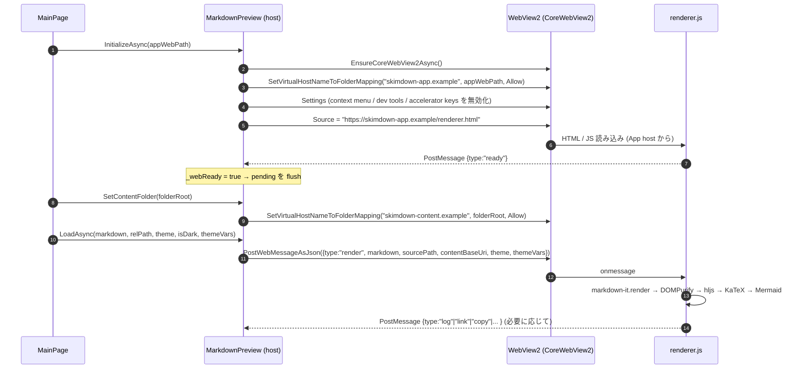

# WebView2 プレビュー

Markdown はすべて WebView2 上のレンダラー (`Assets/Web/renderer.html` + `renderer.js`) で HTML 化される。本ページは host (C#) ↔ renderer (JavaScript) の境界仕様 — どの virtual host が何にマップされ、どのメッセージが行き来し、どんな順で初期化されるか — を記述する。

実装: [`MarkdownPreview.xaml.cs`](../src/SkimDownForWindows/Viewer/MarkdownPreview.xaml.cs) (host)、`src/SkimDownForWindows/Assets/Web/renderer.{html,js}` (renderer)。

## 二重 origin によるサンドボックス

`CoreWebView2.SetVirtualHostNameToFolderMapping` を 2 つの異なるホスト名で行い、**アプリのレンダラーアセット** と **ユーザーが開いたフォルダー** を別 origin に分離する。

| 役割 | virtual host | マップ先 | 設定タイミング |
|---|---|---|---|
| App-asset host (バンドル UI) | `https://skimdown-app.example/` | `Assets/Web/` (`AppContext.BaseDirectory/Assets/Web`) | `InitializeAsync` 1 回のみ。WebView2 のソース URL は `https://skimdown-app.example/renderer.html` |
| Content host (開いているフォルダー) | `https://skimdown-content.example/` | 現在開いているフォルダーの絶対パス | フォルダーを開き直すたびに `SetContentFolder(folderRoot)` で再マップ (`ClearVirtualHostNameToFolderMapping` → `SetVirtualHostNameToFolderMapping`) |

別 origin であるため、レンダラー側 (`skimdown-app.example`) の JavaScript からは Same-Origin Policy で `skimdown-content.example` のリソースを fetch することはできない。Markdown 本文の **テキスト** は host (C#) が `PostWebMessageAsJson` で明示的に渡す。本文がレンダラー origin から直接ファイルを読まないので、renderer 側の脆弱性があっても任意のフォルダー内容をネットワークに漏らすことができない。

`Markdown 本文の渡し方` は `PostWebMessageAsJson` 1 本に限定される。**`NavigateToString` は使わない** (二重 origin 分離を壊し、メッセージプロトコルとも不整合になるため。判断の経緯は ADR を参照)。

## バンドルされる renderer アセット

`src/SkimDownForWindows/Assets/Web/` に同梱され、ビルド時に出力ディレクトリにコピーされる (`*.csproj` の `<Content Include="Assets\Web\**\*.*">` 参照)。CDN 取得は一切行わずオフライン動作する。

| ファイル | 中身 |
|---|---|
| `renderer.html` | エントリーポイント。`renderer.js` と `skimdown.css`、各 vendor を読み込む |
| `renderer.js` | host メッセージ受信ループ、markdown-it 構成、リンク・ショートカット・検索・ズームのハンドラー |
| `skimdown.css` | アプリ既定のスタイル / フォールバック `--skim-*` 変数 |
| `vendor/markdown-it.min.js` ほか | markdown-it 本体 + footnote / emoji / imsize プラグイン |
| `vendor/highlight.min.js` + `vendor/github*.min.css` | シンタックスハイライト (light/dark の 2 CSS をテーマで切替) |
| `vendor/dompurify.min.js` | サニタイズ。HTML 埋め込みはこれを通してから DOM に挿入 |
| `vendor/katex/` | 数式描画 (CSS + JS + 自動レンダラー + フォント woff2) |
| `vendor/mermaid/mermaid.min.js` | 図表 |

## WebView2 設定

`InitializeAsync` 内で `CoreWebView2.Settings` に次を設定する。end-user が想定しない挙動 (browser のデフォルト) を抑止し、ショートカットは renderer 側で受けて host に投げ返す方式に統一する。

| 設定 | 値 | 理由 |
|---|---|---|
| `AreDefaultContextMenusEnabled` | `false` | ブラウザの右クリックメニューは出さない |
| `IsStatusBarEnabled` | `false` | リンク hover ステータスバー非表示 |
| `AreDevToolsEnabled` | `false` | エンドユーザー UI では DevTools 不要 |
| `IsZoomControlEnabled` | `false` | host が `ZoomFactor` を 1 元管理 (`AppSettings.ZoomFactor`) |
| `IsPinchZoomEnabled` | `false` (best-effort) | precision-touchpad pinch は renderer 側で `ctrlKey wheel` として受けて host に再ポストする |
| `AreBrowserAcceleratorKeysEnabled` | `false` (best-effort) | Ctrl+F / Ctrl+P / Ctrl+R / F12 等を browser に消費させない (renderer の keydown が host に流す) |
| `DefaultBackgroundColor` | 透過 | 初回ペイント前に白フラッシュさせない |

## 初期化シーケンス

`_webReady` フラグが立つ前に `LoadAsync` / `SetTheme` / `SetZoom` が呼ばれた場合は host 側で pending に保存し、`ready` 受信で `FlushPendingAsync` がまとめて送る。

## メッセージプロトコル

メッセージはすべて JSON。`type` フィールドで分岐する。

### Host → Renderer (`PostWebMessageAsJson`)

| `type` | フィールド | 目的 |
|---|---|---|
| `render` | `markdown`, `sourcePath`, `contentBaseUri`, `theme`, `themeType`, `themeIsDark`, `themeVars` | Markdown 本文を渡して描画させる |
| `theme` | `theme`, `themeType`, `themeIsDark`, `themeVars` | テーマだけを切替 (Markdown は再描画しない) |
| `zoom` | `factor` | レンダラー zoom 倍率を設定 (host の `ZoomFactor` と sync) |
| `contentMaxWidth` | `value` (CSS 値: `"760px"` / `"960px"` / `"1200px"` / `"none"`) | 本文 (`main.markdown-body`) の `max-width` を `--skim-content-max` CSS 変数経由で上書きする (`AppSettings.ContentMaxWidth` と sync) |
| `empty` | (なし) | 空状態にクリア |
| `search` | `query`, `caseSensitive` | 検索開始 |
| `search/next` / `search/prev` / `search/clear` | (なし) | 検索の前後移動 / クリア |
| `selectAll` | (なし) | preview 内の本文を全選択 |
| `copySelection` | (なし) | 現在の選択を `copy` メッセージで返してもらう (clipboard 連携) |
| `scrollToAnchor` | `hash` | slug ベースのアンカースクロール |

### Renderer → Host (`window.chrome.webview.postMessage`)

[`MarkdownPreview.OnWebMessageReceived`](../src/SkimDownForWindows/Viewer/MarkdownPreview.xaml.cs) で受ける。

| `type` | フィールド | host のアクション |
|---|---|---|
| `ready` | (なし) | `_webReady = true` → `FlushPendingAsync` |
| `log` | `text` | `IAppLogger.LogWarning` (renderer JS のエラーをファイルに記録) |
| `link` | `href`, `kind` (`"external"` / `"relative"` / `"anchor"`) | `external` → `ExternalLinkClicked` イベント (host が `IExternalUriLauncher.LaunchAsync`)、`relative` → `RelativeMarkdownLinkClicked` イベント (host が `LinkResolver` で再分類)、`anchor` は browser がスクロール処理するので何もしない |
| `search/result` | `total`, `current` | `SearchResult` イベント (検索バー UI が件数を更新) |
| `copy` | `text` | `Windows.ApplicationModel.DataTransfer.Clipboard.SetContent` で OS clipboard に書く (preview 内テキストの Ctrl+C 用) |
| `shortcut` | `id` | `ShortcutInvoked` イベント (host が menu のコマンドを実行) |
| `zoomChanged` | `factor` | `ZoomChanged` イベント (Ctrl+wheel / pinch で renderer 側が変えた倍率を host で永続化) |

`NewWindowRequested` (renderer 内の `window.open` / `target="_blank"` 等) は host 側で `e.Handled = true` を立てたうえで `ExternalLinkClicked` に流す。

## 外部リンクのフロー

`http(s)` リンクが renderer で classify されると、`{type:"link", kind:"external", href}` が host に届く。host (`MainPage`) はこれを購読しており、`IExternalUriLauncher.LaunchAsync(new Uri(href))` を呼ぶ。Application 層から `Windows.System.Launcher` を直接呼ばないため、テスト用の差し替えが効く ([`LauncherExternalUriService`](../src/SkimDownForWindows.Infrastructure/Windows/LauncherExternalUriService.cs))。

相対 Markdown リンクの classify は host 側 `LinkResolver` が行う ([markdown-content-pipeline.md](markdown-content-pipeline.md#リンクの分類-linkresolver) 参照)。renderer から host に届く `{kind:"relative"}` メッセージは raw `href` だけを伝え、フォルダー外 / 非 Markdown の判定は host で行う。

## HTML 埋め込みのサニタイズ

renderer は markdown-it のレンダリング結果に DOMPurify を必ず通す。`script`, `iframe`, `object`, `embed`, `style`, `onclick` 等のイベント属性、`javascript:` URL は DOMPurify が除去する。SkimDown 側で追加のホワイトリストを書いていない (DOMPurify のデフォルトポリシーに従う)。

許可される基本的なタグ: `details`, `summary`, `kbd`, `mark`, `sup`, `sub`, `br`, `span`, `div` 等。

## テーマの伝達

`{type:"theme"}` のペイロードに含まれる `themeVars` は **`--skim-*` プレフィックスのみ** が host 側 `CloneThemeVars` で安全網フィルタを通過する。renderer 側でも同じプレフィックスを再チェックする (二重防御)。値の妥当性は Application 層の [`ColorValueValidator`](../src/SkimDownForWindows.Application/Theme/ColorValueValidator.cs) で事前検証されているので、`var(--x)` / `calc(...)` / `;` / `{` / `}` 等が混ざることはない。

テーマ全体の解決経路は [theming.md](theming.md) を参照。

## 関連

- ADR: [0002 クリーンアーキテクチャー風の層分割と DI](../.github/adr/0002-clean-architecture-layered-projects.md), [0004 VS Code 互換のカスタムカラースキーマ対応](../.github/adr/0004-custom-color-schemes.md)
- SPEC: [`design/SPEC.md`](../design/SPEC.md) の「プレビュー」「Markdown対応」「コードブロック」「HTML埋め込み」「画像」「セキュリティ」
- 隣接ドキュメント: [`theming.md`](theming.md), [`markdown-content-pipeline.md`](markdown-content-pipeline.md), [`settings-and-state.md`](settings-and-state.md)
- コード: [`MarkdownPreview.xaml.cs`](../src/SkimDownForWindows/Viewer/MarkdownPreview.xaml.cs), `src/SkimDownForWindows/Assets/Web/renderer.{html,js}`, [`MainPage.xaml.cs`](../src/SkimDownForWindows/MainPage.xaml.cs)
