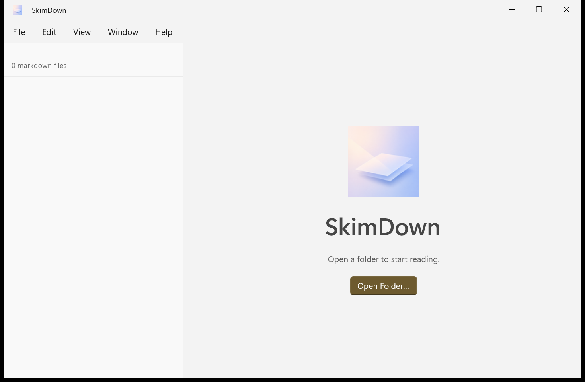
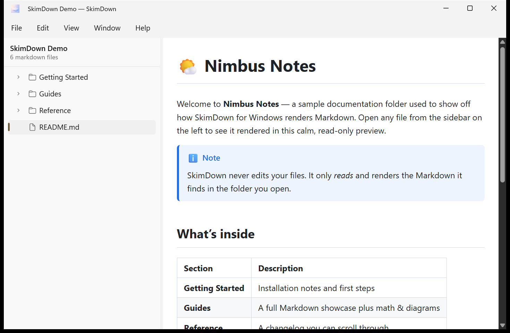

# 1. Getting started

This page covers installing SkimDown, launching it for the first time, and what you see before you
open anything.

## Install SkimDown

SkimDown is a packaged Windows app. Install it one of two ways:

- **Microsoft Store** — search for **SkimDown** and choose **Get / Install**. This is the
  recommended route and keeps the app updated automatically.
- **Sideload (`.msixbundle`)** — if you were given a signed sideload package, install the
  certificate once and then add the package:

  ```powershell
  certutil -addstore -f "TrustedPeople" .\devcert.cer   # run as admin, one time
  Add-AppxPackage .\45014okazuki.SkimDown_<version>_sideload.msixbundle
  ```

> **Note:** Once a Microsoft Store build is installed, a sideload build of the same app cannot be
> upgraded in place. Uninstall the sideload version before installing the Store version.

After installation, a `skimdown` command alias is registered automatically, so you can launch the
app from any terminal (see [Opening content](02-opening-content.md)).

## First launch — the welcome screen

When SkimDown starts without a folder, it shows the welcome screen. The sidebar reads
**0 markdown files**, and the preview area invites you to begin.



From here you can:

- Click **Open Folder…** in the center of the window, or
- Use **File → Open Folder…** (**Ctrl+O**), or
- Drag a folder from File Explorer onto the window.

## Your first folder

Once you open a folder, SkimDown lists every Markdown file it finds in the sidebar and renders the
first file (or the file you last viewed) in the preview.



The sidebar header shows the folder name and a count such as **6 markdown files**. Select any file
in the tree to read it.

## Where to go next

- Learn every way to open content → [Opening content](02-opening-content.md)
- Understand the window layout → [The folder view & navigation](03-folder-view-and-navigation.md)
