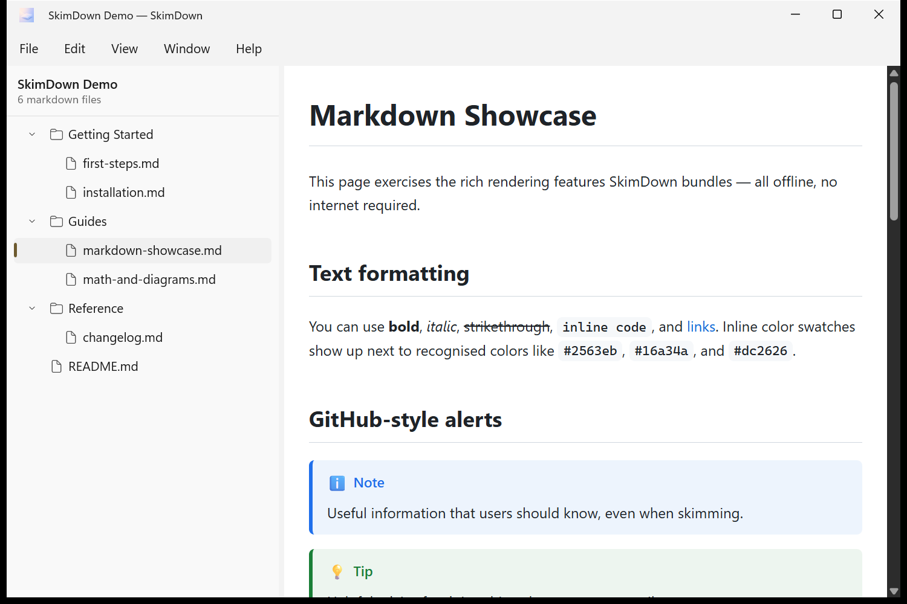

# 3. The folder view & navigation

Once a folder is open, SkimDown shows two areas: the **sidebar tree** on one side and the
**preview** on the other.

## Window anatomy

1. **Title bar** — shows the folder name and the app name, e.g. `SkimDown Demo — SkimDown`.
2. **Menu bar** — **File**, **Edit**, **View**, **Window**, **Help**.
3. **Sidebar header** — the folder name plus a count such as **6 markdown files**.
4. **Sidebar tree** — every Markdown file in the folder, organized by subfolder.
5. **Preview** — the rendered Markdown of the selected file.

## The sidebar tree

SkimDown scans the folder **recursively** for `.md` and `.markdown` files and shows them
folder‑first, sorted case‑insensitively. Files inside subfolders (like `Getting Started`,
`Guides`, and `Reference` above) are grouped under their folders.

Hidden files and noise directories are filtered out automatically — folders such as `.git`,
`node_modules`, `.build`, and `DerivedData` are never shown in the tree.

### Navigating

- **Click a file** to render it in the preview.
- **Click a folder** (or its chevron) to expand or collapse it.
- Press **Ctrl+B** to hide or show the sidebar entirely (**View → Toggle Sidebar**).

SkimDown **remembers your expansion state per folder**, as well as the last file you had selected,
so reopening a folder restores your previous state.

## Live updates

The tree and preview stay in sync with disk. If Markdown files are **added, deleted, renamed, or
updated** while a folder is open, SkimDown refreshes automatically — no manual reload needed.

## Moving or hiding the sidebar

You can put the sidebar on the **left** or the **right**, or hide it completely. See
[View & appearance](07-view-and-appearance.md#sidebar).
