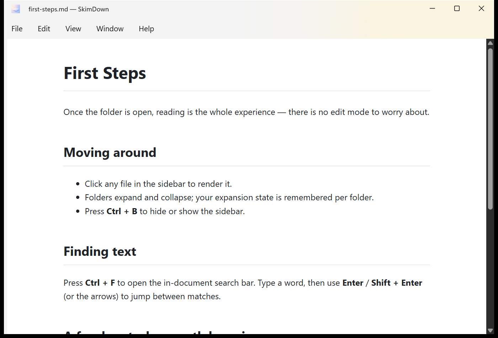

# 5. Single‑file mode

Sometimes you just want to read **one** Markdown file, not a whole folder. When you open a `.md`
file directly, SkimDown enters **single‑file mode**: the sidebar is hidden and the preview takes
the full window.

The title bar shows the file name, e.g. `first-steps.md — SkimDown`.

## How to enter single‑file mode

- **File Explorer** — right‑click a `.md` / `.markdown` file → **Open with → SkimDown** (you can
  set SkimDown as the default for `.md` files after the first time).
- **Command line** — `skimdown README.md`.
- **Drag‑and‑drop** — drag a single `.md` file onto a SkimDown window. If that window already has
  a folder or another file open, the dropped file opens in a **new** window.
- **Multiple files** — select several `.md` files in Explorer and choose **Open with → SkimDown**;
  each file opens in its own window.

## What's different in single‑file mode

- The **sidebar is hidden**, and **Toggle Sidebar** (Ctrl+B) and **Move Sidebar** are disabled.
- The file's **parent folder is still watched**, so external edits to the open file refresh the
  preview live.
- **Relative Markdown links** (for example `[next](./next.md)`) open in a **new** single‑file
  window.
- Your folder history is left unchanged: **recent folders, last folder, and per‑folder expansion
  state are not updated**. Double‑clicking files in Explorer does not affect your folder history.
- Your saved sidebar visibility is preserved. Open a folder later with **File → Open Folder…** and
  the sidebar returns exactly as you had it configured.

## Returning to folder reading

Open any folder (**File → Open Folder…**, **Ctrl+O**, or drag a folder onto the window) to leave
single‑file mode and bring the sidebar back.
