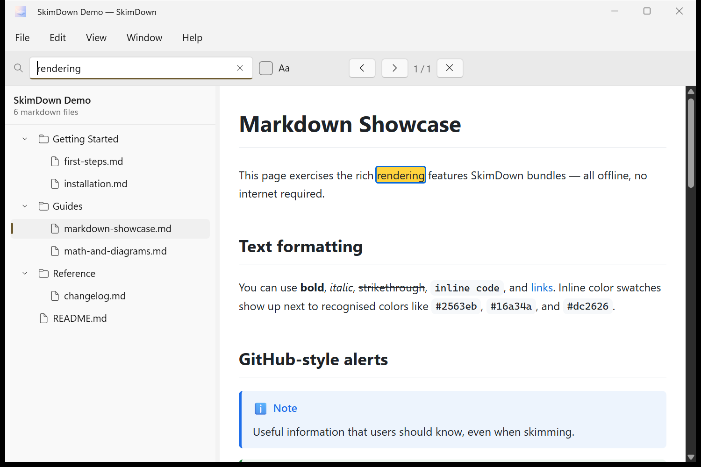
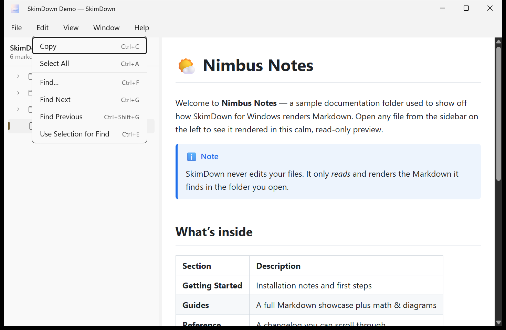

# 6. Searching & copying

SkimDown is read‑only, but you can search within a document and copy text or file paths out of it.

## Find text in the current file

Press **Ctrl+F** (or **Edit → Find…**) to open the in‑document search bar at the top of the window.
Type a word and SkimDown highlights every match, showing a counter such as **1 / 1**.

The Find bar controls, left to right:

- **Search box** — type your query; the **✕** inside it clears the text.
- **Aa** — toggle **match case** on or off.
- **‹** / **›** — jump to the previous / next match (**Ctrl+Shift+G** / **Ctrl+G**).
- **1 / 1** — the current match and total match count.
- **✕** — close the Find bar.

You can also press **Enter** / **Shift+Enter** to move between matches.

### Search using the current selection

Select some text in the preview, then choose **Edit → Use Selection for Find** (**Ctrl+E**) to
search for exactly that text.

## Copy and select

| Item | Shortcut | What it does |
| --- | --- | --- |
| **Copy** | Ctrl+C | Copy the selected text from the preview. |
| **Select All** | Ctrl+A | Select all text in the current document. |
| **Find…** | Ctrl+F | Open the in‑document search bar. |
| **Find Next** | Ctrl+G | Go to the next match. |
| **Find Previous** | Ctrl+Shift+G | Go to the previous match. |
| **Use Selection for Find** | Ctrl+E | Search for the currently selected text. |

## Copy a file's path or reveal it

From the **File** menu:

- **Copy File Path** — copies the selected file's full path to the clipboard.
- **Reveal in File Explorer** — opens File Explorer with the file (or folder) selected.
