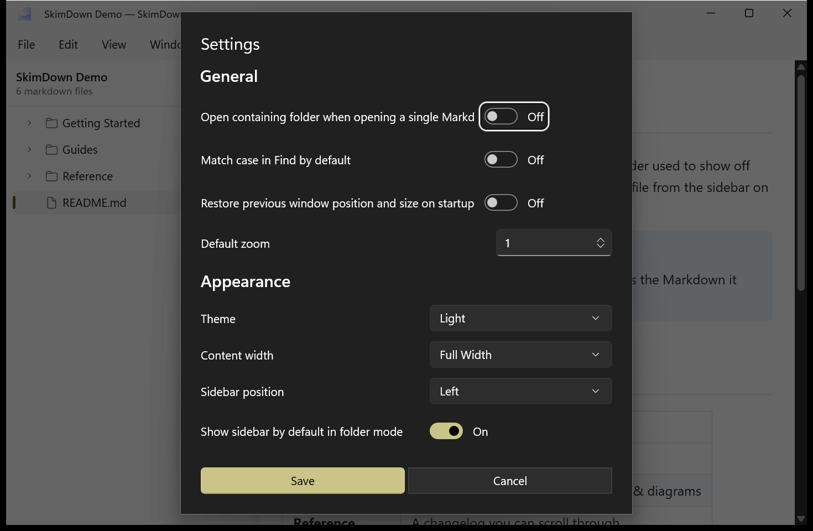

# 9. Settings

Open **View → Settings…** to fine‑tune SkimDown's behavior and appearance defaults. Change what you
need, then click **Save** (or **Cancel** to discard).

> The Settings dialog follows your Windows system theme, so it may appear dark even when the
> preview is set to Light.

## General

| Setting | What it does |
| --- | --- |
| **Open containing folder when opening a single Markdown file** | When **On**, opening one `.md` file also loads its folder into the sidebar instead of using single‑file mode. Default **Off**. |
| **Match case in Find by default** | When **On**, the Find bar starts with case‑sensitive matching enabled. Default **Off**. |
| **Restore previous window position and size on startup** | When **On**, SkimDown reopens at the same location and size as last time. Default **Off**. |
| **Default zoom** | The preview zoom level used for new windows (1 = 100 %). |

## Appearance

| Setting | What it does |
| --- | --- |
| **Theme** | The preview theme: **System**, **Light**, **Dark**, or one of your custom themes. |
| **Content width** | The text column width: **Standard (760 px)**, **Wide (960 px)**, **Extra Wide (1200 px)**, or **Full Width**. |
| **Sidebar position** | Put the folder tree on the **Left** or the **Right**. |
| **Show sidebar by default in folder mode** | When **On**, the sidebar is visible whenever you open a folder. Default **On**. |

These same options are also reachable from the **View** menu — see
[View & appearance](07-view-and-appearance.md). Settings are saved per user and persist between
sessions.
