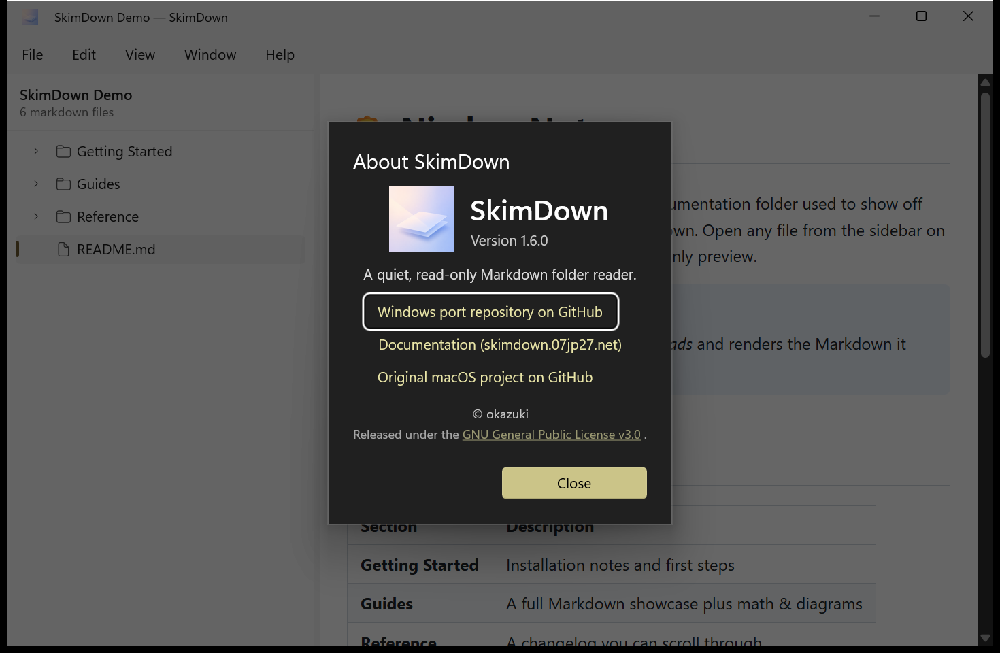

# 11. Tips & troubleshooting

## Live reload

SkimDown watches the folder you have open. When Markdown files are **added, deleted, renamed, or
changed** on disk, the sidebar tree and the preview refresh automatically. This also works in
[single‑file mode](05-single-file-mode.md) for the open file. You never need to reload manually.

## Your content stays local

SkimDown is **local‑only**: there is no telemetry, and no Markdown text leaves your machine. All
rendering assets (highlighting, math, diagrams) are bundled with the app, so the preview works
**fully offline** with no CDN or internet connection.

## One window per file, by design

SkimDown runs as a **single process** per user. The second time you double‑click a Markdown file in
Explorer, the activation is routed to the existing SkimDown process rather than launching a
duplicate. This keeps your settings from being overwritten by competing windows.

## Check your version

Open **Help → About SkimDown** to see the version and project links.

The About dialog shows the version (**1.6.0**), a short description, and links to the Windows port
repository, the documentation site, and the original macOS project. (Like the Settings dialog, it
follows your Windows system theme and may appear dark.)

## Common questions

**Can I edit files in SkimDown?**
No — SkimDown is a **read‑only** reader. It never modifies your files. Use your normal editor to
make changes; SkimDown will live‑reload to show them.

**My folder looks empty / shows "0 markdown files."**
SkimDown only lists `.md` and `.markdown` files, and it skips hidden files and noise directories
like `.git`, `node_modules`, `.build`, and `DerivedData`. If a folder has no Markdown outside those,
it will read as empty.

**A relative link opened a new window.**
That's expected in single‑file mode — relative Markdown links open in a new single‑file window. In
folder mode, use the sidebar to move between files.

**The Settings or About window is dark even though I chose Light.**
These dialogs intentionally follow your Windows system theme. Only the **preview** follows the
theme you pick in **View → Theme**.

**The window didn't reopen where I left it.**
Turn on **Restore previous window position and size on startup** in
[Settings](09-settings.md).

**`skimdown` isn't recognized in my terminal.**
The `skimdown` alias is registered when the app is installed. Open a **new** terminal after
installing, or launch the app once from the Start menu, then try again.
