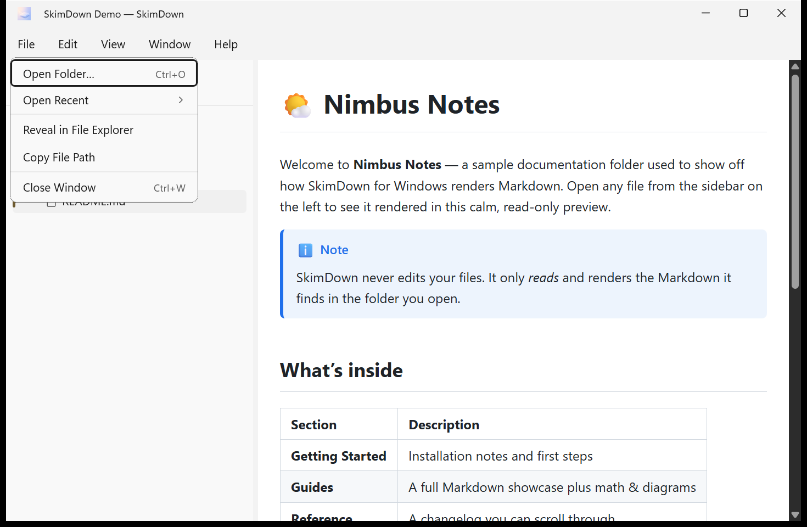
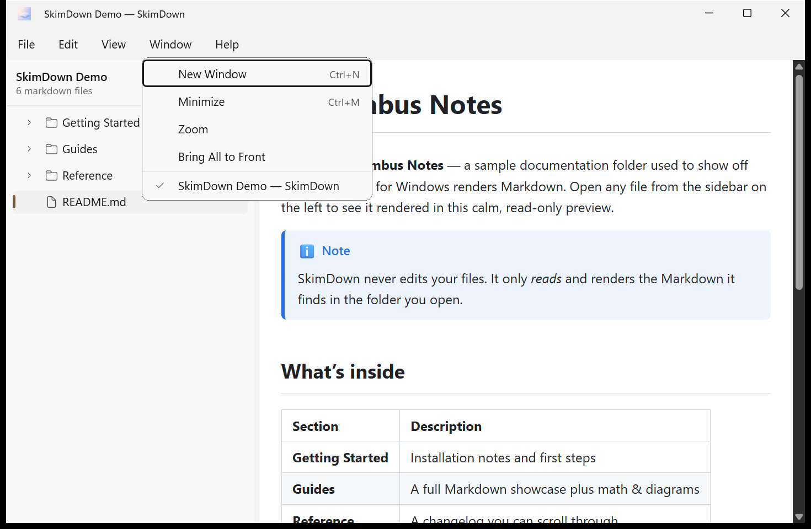

# 2. コンテンツを開く

SkimDown には、Markdown のフォルダーを開く方法がいくつか用意されています。ワークフローに合った方法を選んでください。

## フォルダーを開く

次のいずれかを使います。

- **File → Open Folder…**（ファイル → フォルダーを開く）
- **Ctrl+O**
- エクスプローラーから **フォルダーをドラッグ**して SkimDown のウィンドウにドロップする。
- **コマンドライン:** `skimdown D:\notes`（または任意のターミナルで現在のフォルダーを開くには `skimdown .`）。

**File**（ファイル）メニューには、ほかに次の項目もあります。

| 項目 | 機能 |
| --- | --- |
| **Open Folder…**（Ctrl+O） | 読むフォルダーを選びます。 |
| **Open Recent** ▸ | 最近表示したフォルダーを再び開きます。 |
| **Reveal in File Explorer** | 現在のファイルまたはフォルダーをエクスプローラーで表示します。 |
| **Copy File Path** | 選択中のファイルのフルパスをクリップボードにコピーします。 |
| **Close Window**（Ctrl+W） | 現在のウィンドウを閉じます。 |

### 最近使ったフォルダーを開く

**File → Open Recent**（ファイル → 最近使ったフォルダーを開く）には、以前に開いたフォルダーが一覧表示されるため、参照し直すことなく戻れます。SkimDown はセッションをまたいで最近使ったフォルダーを記憶します。（単一の `.md` ファイルを開いても、この一覧には**追加されません** — [単一ファイルモード](05-single-file-mode.md) を参照してください。）

## 複数ウィンドウ

複数のフォルダーを同時に、それぞれ別のウィンドウで読むことができます。

- **Window → New Window**（ウィンドウ → 新しいウィンドウ、**Ctrl+N**）で、空のウィンドウをもう 1 つ開きます。
- **すでに**フォルダーが開いているウィンドウにフォルダーをドロップすると、ドロップしたフォルダーが**新しい**ウィンドウで開き、現在のウィンドウには影響しません。
- **Window**（ウィンドウ）メニューの下部には、開いているすべてのウィンドウが一覧表示され、アクティブなものにチェックが付きます。**Bring All to Front**（すべてを前面に表示）でまとめて表示したり、**Minimize**（最小化、**Ctrl+M**）/ **Zoom**（ズーム）で現在のウィンドウを操作したりできます。

## 単一ファイルを開く

フォルダー全体ではなく Markdown ファイルを 1 つだけ開くには、[単一ファイルモード](05-single-file-mode.md) を参照してください。要点としては、エクスプローラーで `.md` ファイルをダブルクリックする（**Open with → SkimDown**）、`skimdown README.md` を実行する、または単一の `.md` ファイルをウィンドウにドラッグします。
