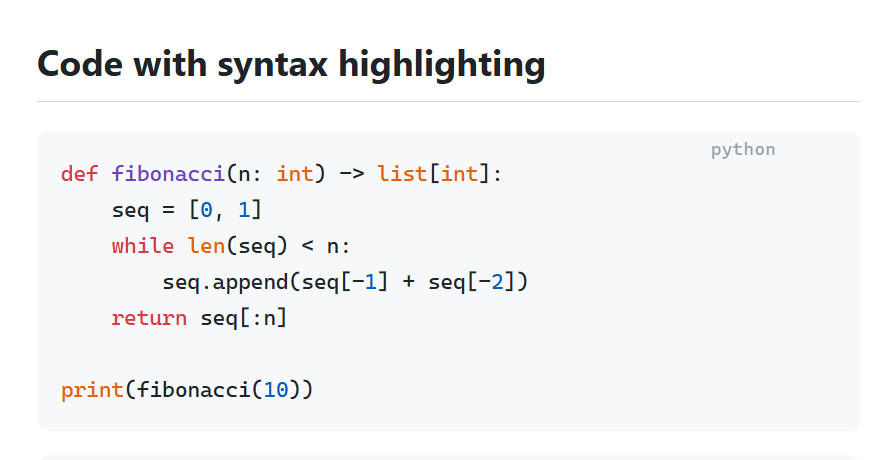
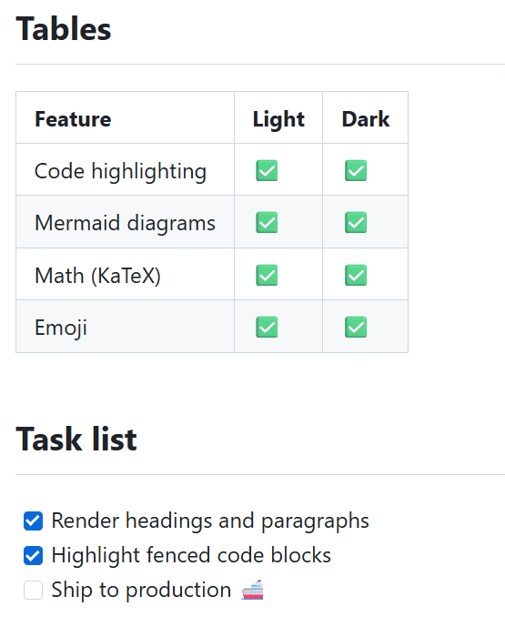
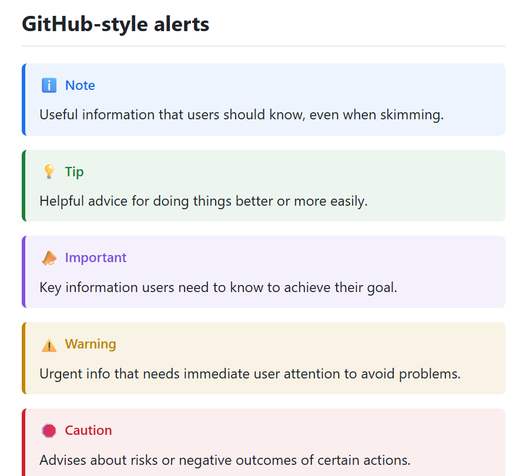
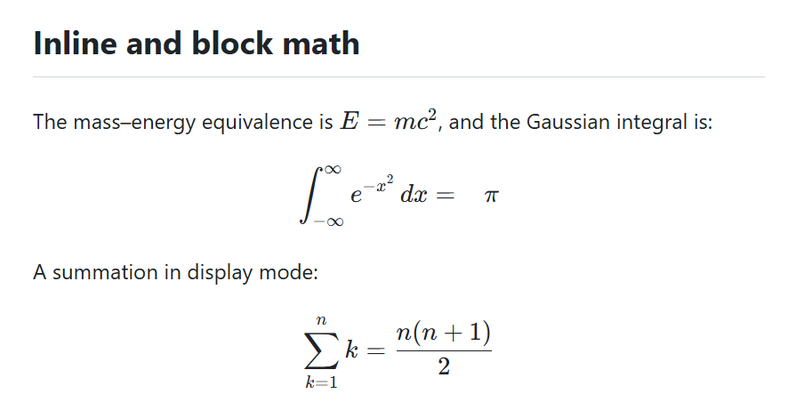
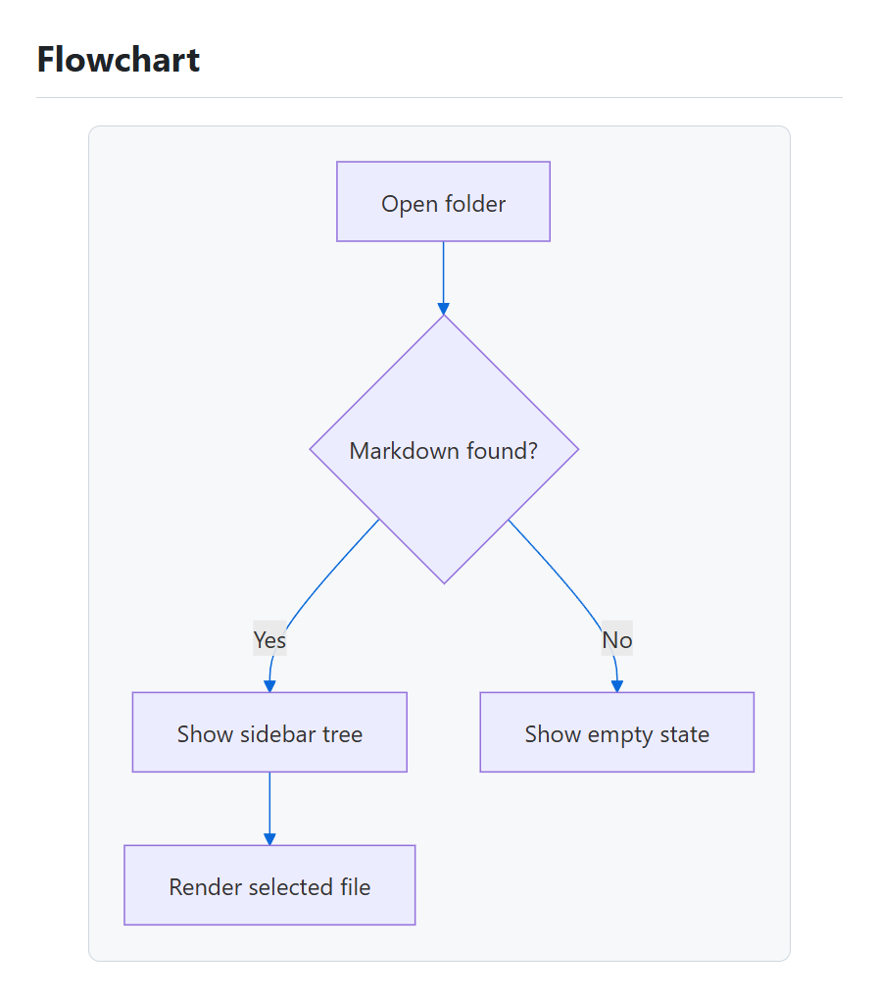

# 4. Markdown を読む

SkimDown はバンドルされたエンジン（markdown‑it + highlight.js + KaTeX + Mermaid + emoji）でリッチな Markdown をレンダリングするため、すべてが完全に**オフライン**で動作します。CDN もインターネットも不要です。このページでは、レンダリングされる内容を紹介します。

## テキスト書式とカラースウォッチ

標準的なインライン書式に対応しています — **太字**、*斜体*、~~取り消し線~~、`インラインコード`、リンク。SkimDown が色の値（`#2563eb` など）を認識すると、その隣に小さな**カラースウォッチ**を表示します。

## シンタックスハイライト付きコードブロック

フェンス付きコードブロックはシンタックスハイライトされ、言語が隅に表示されます。



## 表とタスクリスト

GitHub 形式の表とタスクリスト（チェックボックス）がレンダリングされ、絵文字のショートコードは絵文字に変換されます。



## GitHub 形式のアラート

引用ブロックのアラート — **Note**、**Tip**、**Important**、**Warning**、**Caution** — は、おなじみの色とアイコンでスタイル付けされます。



## KaTeX による数式

`$E = mc^2$` のようなインライン数式や、ディスプレイ数式（`$$ … $$`）は **KaTeX** で組版されます。



## Mermaid による図

フェンス付きの ` ```mermaid ` ブロックは、図としてレンダリングされます — フローチャート、シーケンス図など。



> **ヒント:** Mermaid の図をクリックすると、拡大・ズーム可能な大きな表示で開きます。大きなグラフに便利です。

## 快適に読むために

- プレビュー全体を**ズーム**で拡大・縮小したり、テキスト列の**幅**を設定したりできます — [表示と外観](07-view-and-appearance.md) を参照。
- **Ctrl+F** で現在のファイル内のテキストを**検索**できます — [検索とコピー](06-search-and-copy.md) を参照。
