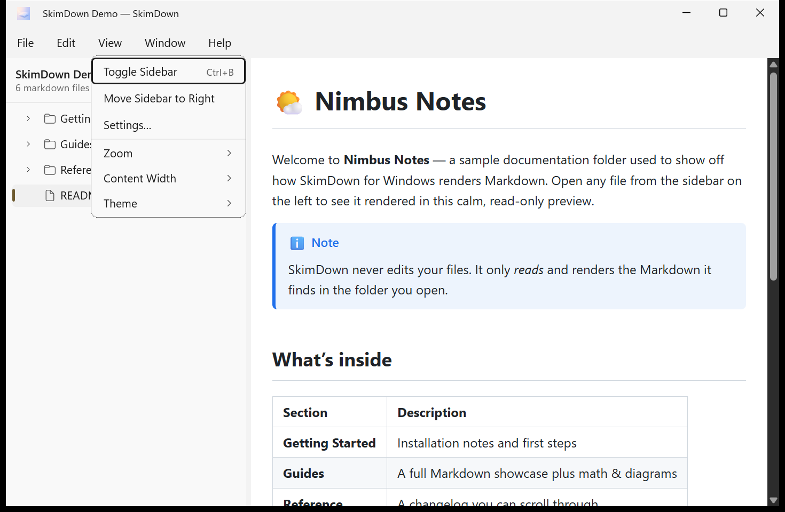
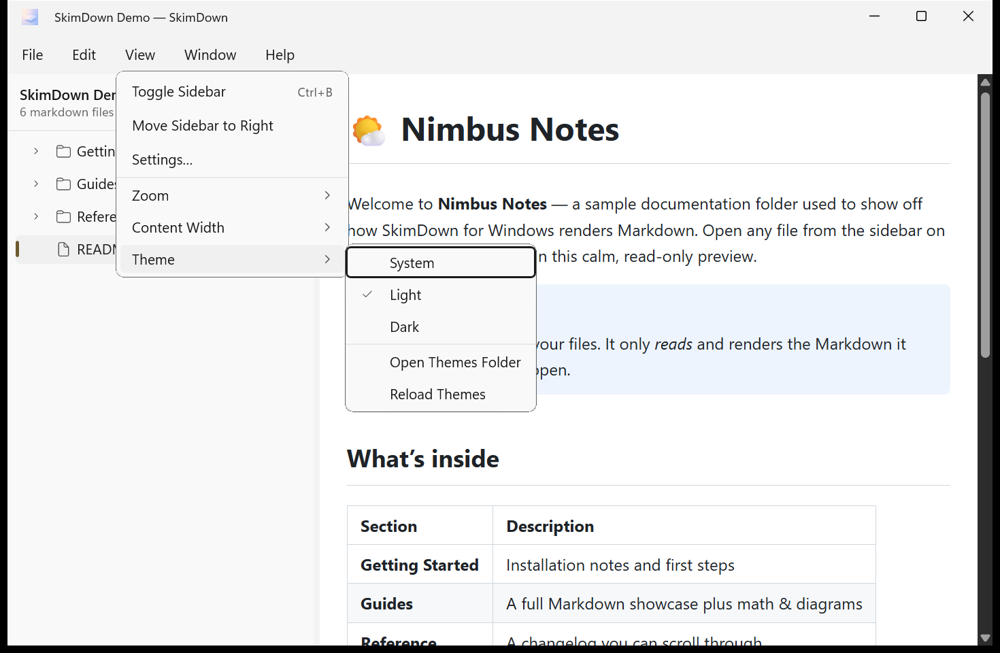
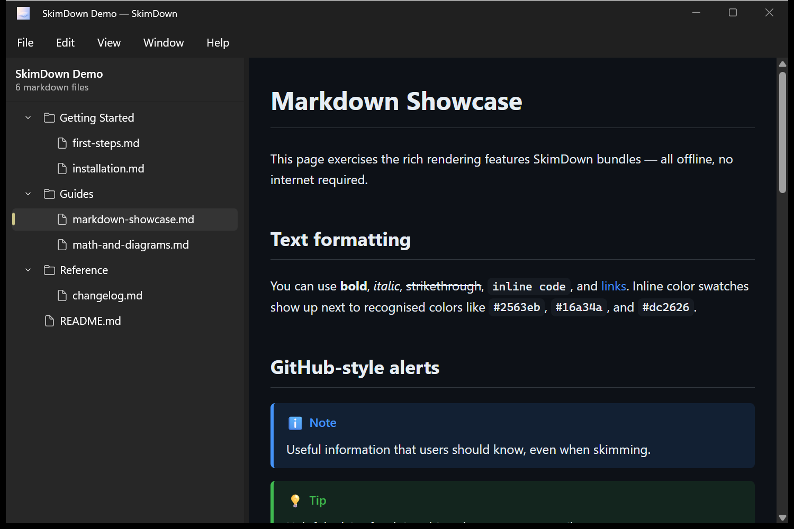
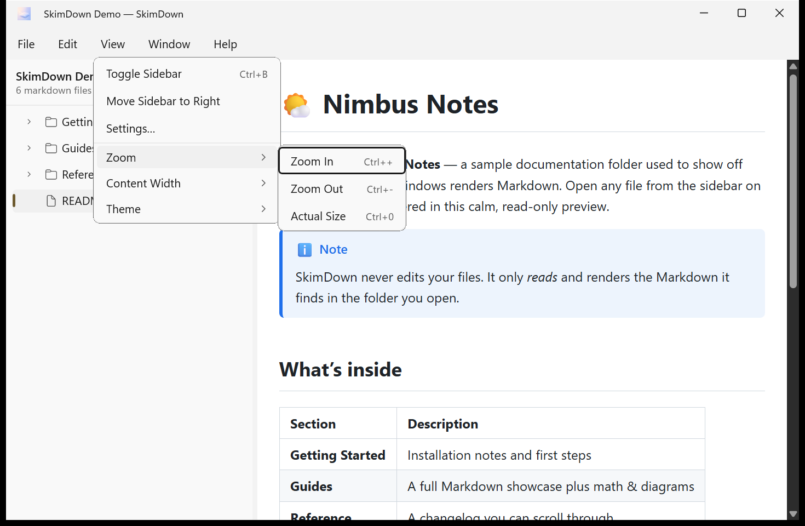
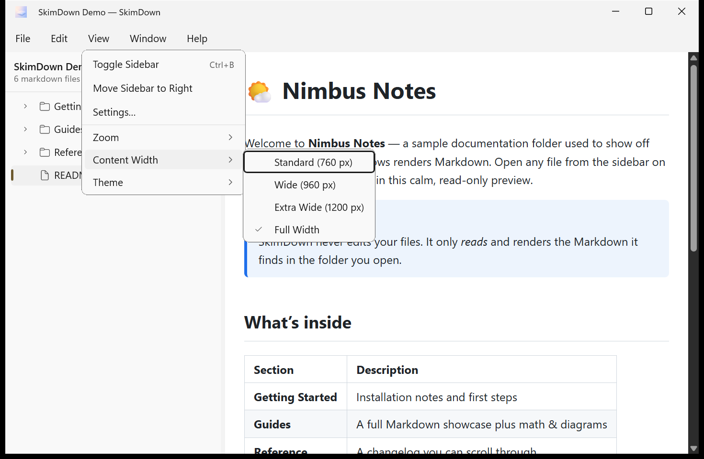
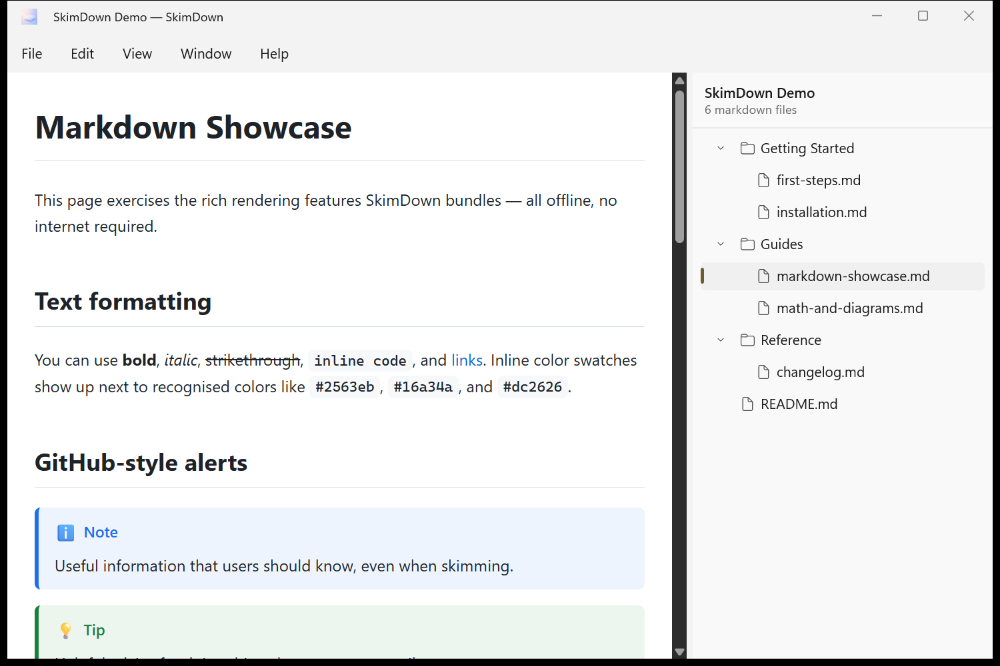

# 7. 表示と外観

**View**（表示）メニューでは、コンテンツの見え方を制御します。サイドバー、テーマ、ズーム、テキスト幅です。

## テーマ

**View → Theme**（表示 → テーマ）で、次の中から切り替えます。

- **System** — Windows のライト/ダーク設定に従います。
- **Light**
- **Dark**

現在のテーマにはチェックが付きます。同じサブメニューには、追加した**カスタムカラースキーム**に加えて、**Open Themes Folder**（テーマフォルダーを開く）と **Reload Themes**（テーマを再読み込み）も表示されます — [カスタムカラースキーム](08-custom-themes.md) を参照してください。

同じコンテンツを **Dark** テーマで表示すると、次のようになります。

> **注意:** **Settings**（設定）ダイアログと **About**（バージョン情報）ダイアログは常に Windows のシステムテーマに従うため、プレビューが Light に設定されていても Dark で表示されることがあります。これは仕様です。

## ズーム

**View → Zoom**（表示 → ズーム）で、プレビューを拡大・縮小します。

| 操作 | ショートカット |
| --- | --- |
| **Zoom In**（拡大） | Ctrl + `+` |
| **Zoom Out**（縮小） | Ctrl + `-` |
| **Actual Size**（実際のサイズ） | Ctrl + `0` |

**Ctrl + マウスホイール**や**精密タッチパッドのピンチ**でもスムーズにズームできます。ズームレベルはセッションをまたいで**記憶**され、50〜300 % の範囲に制限されます。

## コンテンツ幅

**View → Content Width**（表示 → コンテンツ幅）で、テキスト列の幅を制御します。

- **Standard (760 px)** — 快適に読める文字数。
- **Wide (960 px)**
- **Extra Wide (1200 px)**
- **Full Width** — プレビュー領域全体を使います。

**Ctrl + ]**（広く）と **Ctrl + [**（狭く）で幅を段階的に切り替えられます。

## サイドバー

サイドバーの位置を変更したり、非表示にしたりできます。

- **View → Toggle Sidebar**（表示 → サイドバーの切り替え、**Ctrl+B**） — ツリーの表示/非表示を切り替えます。
- **View → Move Sidebar to Right / Left**（表示 → サイドバーを右/左に移動） — ツリーをどちら側に置くかを切り替えます。

SkimDown はサイドバーの**位置**、**表示状態**、**幅**をセッションをまたいで記憶します。
